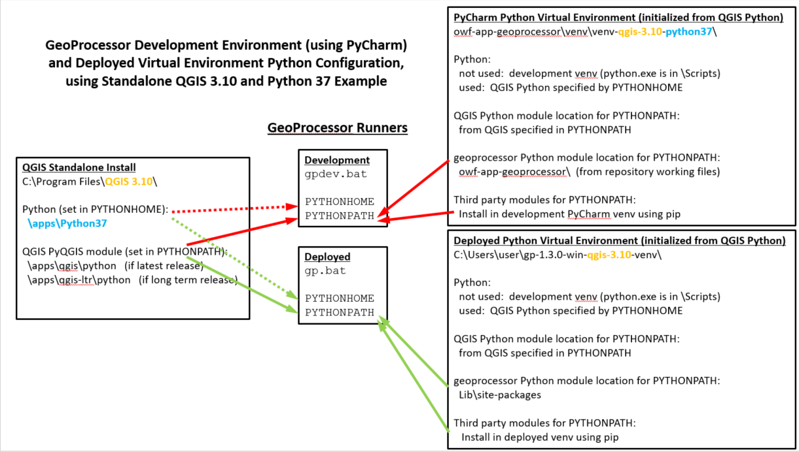

# GeoProcessor / Development Environment / Running the GeoProcessor #

*   [Running GeoProcessor in the Development Environment](#running-geoprocessor-in-the-development-environment)
    +   [Running GeoProcessor from the Command Line](#running-geoprocessor-from-the-command-line)
    +   [Running GeoProcessor in PyCharm](#running-geoprocessor-in-pycharm)
*   [Running GeoProcessor in the  Build System Virtual Environment](#running-geoprocessor-in-the-build-system-virtual-environment)
*   [Running GeoProcessor in the Operational Virtual Environment](#running-geoprocessor-in-the-operational-virtual-environment)
*   [Running GeoProcessor in the Testing Framework Environment](#running-geoprocessor-in-the-testing-framework-environment)

----------------

## Running GeoProcessor in the Development Environment ##

The GeoProcessor is typically run in the development environment using a batch file (Windows) or script (Linux) that
configures the Python environment and starts the application.
The GeoProcessor can also be run from PyCharm, for example to use debugging features or because it is the developer's preference;
however, the command line approach is closer to deployed solution and therefore 
will likely point out issues that will be encountered in the deployed system.
Running from the command line may also be faster given that PyCharm is not involved.

The GeoProcessor is typically tested by [running functional tests during development](../dev-tasks/testing.md#functional-tests).

The following diagram illustrates the GeoProcessor development and deployed environments.

**<p style="text-align: center;">

</p>**

**<p style="text-align: center;">
GeoProcessor / QGIS / Python Configuration (<a href="../images/gp-python-config.png">see full-size image</a>)
</p>**

The right side of the diagram illustrates how the `gpdev.bat` script configures the Python environment
to use the GeoProcessor code files in the repository.

### Running GeoProcessor from the Command Line ###

Running the GeoProcessor from the command line requires using a batch file (Windows) or script, as summarized in the following table.
The files are located in the `scripts` folder in the development repository.
Similar `gp` and `gpui` versions (no `dev`) are found in the `Scripts` folder in the deployed virtual environment.

**<p style="text-align: center;">
GeoProcessor Scripts and Batch Files used in Development Environment
</p>**

| **Windows Batch File**&nbsp;&nbsp;&nbsp;&nbsp;&nbsp;&nbsp;&nbsp;&nbsp;&nbsp;&nbsp;&nbsp;&nbsp;&nbsp;&nbsp; | **Linux Script** | **Description** |
| -- | -- | -- |
| `gpdev.bat` | `gpdev` | Core program that configures environment for QGIS, Python, and GeoProcessor.  The default run mode is the command line interface. |
| `gpuidev.bat` | `gpuidev` | Run `gpdev --ui` |

The implementation status for command line GeoProcessor for each operating system is listed below:

*    Cygwin:
    +   `gpdev` - **Not tested.**
    +   Run the testing framework by deploying to Cygwin Python virtual machine to run testing framework
*    Linux:
    +   `gpdev` - **Not tested.**
    +   Run the testing framework by deploying to Linux Python virtual machine to run testing framework
*    Windows 10:
    +   [`gpdev.bat`](https://github.com/OpenWaterFoundation/owf-app-geoprocessor-python/tree/main/scripts/gpdev.bat) - **tested and used for development**
    +   [`gpuidev.bat`](https://github.com/OpenWaterFoundation/owf-app-geoprocessor-python/tree/main/scripts/gpuidev.bat) - **tested and used for development**

## Running GeoProcessor in PyCharm ##

TODO smalers 2020-03-29 This section needs to be completed once PyCharm setup documentation is updated.

## Running GeoProcessor in the Build System Virtual Environment ##

The GeoProcessor from the development environment is packaged into an installer that can be installed to deploy in operational systems.
The build system creates an intermediate virtual environment to assemble files for the installer.
The GeoProcessor can be run in this intermediate virtual environment to do testing using an environment that is similar
to that expected in the deployed environment.  Consequently, testing can point out issues and save time.

To run in this environment, run the `gp.bat` and `gpui.bat` batch files (Windows) or `gp` and `gpui` scripts (Linux) located in
a folder similar to:

```
build-util/venv-tmp/gp-1.3.0-win-gqis-3.10-venv/Scripts
``` 

## Running GeoProcessor in the Operational Virtual Environment ##

The GeoProcessor operational (deployed) environment can be run using batch files (Windows) and scripts (Linux). 
The GeoProcessor is distributed in a virtual environment that is typically installed in the user's home folder,
but may be installed on a system folder.  For example, for Windows the deployed folder is similar to:

```
C:\Users\user\gp-1.3.0-win-qgis-3.10-venv/
```

The following table lists the program files used to run the GeoProcessor, which are found in the `Scripts` folder within the main deployed folder.

**<p style="text-align: center;">
GeoProcessor Scripts and Batch Files used in Operational Environment
</p>**

| **Windows Batch File**&nbsp;&nbsp;&nbsp;&nbsp;&nbsp;&nbsp;&nbsp;&nbsp;&nbsp;&nbsp;&nbsp;&nbsp;&nbsp;&nbsp; | **Linux Script** | **Description** |
| -- | -- | -- |
| `gp.bat` | `gp` | Core program that configures environment for QGIS, Python, and GeoProcessor.  The default run mode is the command line interface. |
| `gpui.bat` | `gpui` | Run `gp --ui` |

The implementation status for each operating system is listed below:

*    Cygwin:
    +   [`gp`](https://github.com/OpenWaterFoundation/owf-app-geoprocessor-python/tree/main/scripts/gp) - **has not been tested recently**
    +   [`gpui`](https://github.com/OpenWaterFoundation/owf-app-geoprocessor-python/tree/main/scripts/gpui) - **has not been tested recently**
*    Linux:
    +   [`gp`](https://github.com/OpenWaterFoundation/owf-app-geoprocessor-python/tree/main/scripts/gp) - **has not been tested recently**
    +   [`gpui`](https://github.com/OpenWaterFoundation/owf-app-geoprocessor-python/tree/main/scripts/gpui) - **has not been tested recently**
*    Windows 10:
    +   [`gp.bat`](https://github.com/OpenWaterFoundation/owf-app-geoprocessor-python/tree/main/scripts/gp.bat) - **tested and used operationally**
    +   [`gpui.bat`](https://github.com/OpenWaterFoundation/owf-app-geoprocessor-python/tree/main/scripts/gpui.bat) - **tested and used operationally**

## Running GeoProcessor in the Testing Framework Environment ##

**The `gptest` variant of the GeoProcessor is not currently actively developed.
The `gptest` variant stripped out QGIS code and provided a Python command-based tool that could be used for testing.
Instead, use the full GeoProcessor, [TSTool software](http://software.openwaterfoundation.org/), or other testing tools for testing.
The following documentation is out of date and will be removed in a future release.**

The GeoProcessor can be run in a limited test environment that does not use the QGIS software,
using a script that uses Python 3 in a Python virtual environment:

*    Cygwin:
    +   [`scripts/gptest`](https://github.com/OpenWaterFoundation/owf-app-geoprocessor-python/tree/main/scripts/gptest) shell script
    +   [`scripts/gptestui`](https://github.com/OpenWaterFoundation/owf-app-geoprocessor-python/tree/main/scripts/gptestui) shell script to run UI
*    Linux:
    +   [`scripts/gptest`](https://github.com/OpenWaterFoundation/owf-app-geoprocessor-python/tree/main/scripts/gptest) shell script
    +   [`scripts/gptestui`](https://github.com/OpenWaterFoundation/owf-app-geoprocessor-python/tree/main/scripts/gptestui) shell script to run UI
*    Windows 10:
    +   `scripts/gptest.bat` - **Not yet developed.**

This approach can use the GeoProcessor as a functional test framework independent of QGIS.
It is common to run the testing framework to run [functional tests for a software product](../dev-tasks/testing.md#functional-tests).
