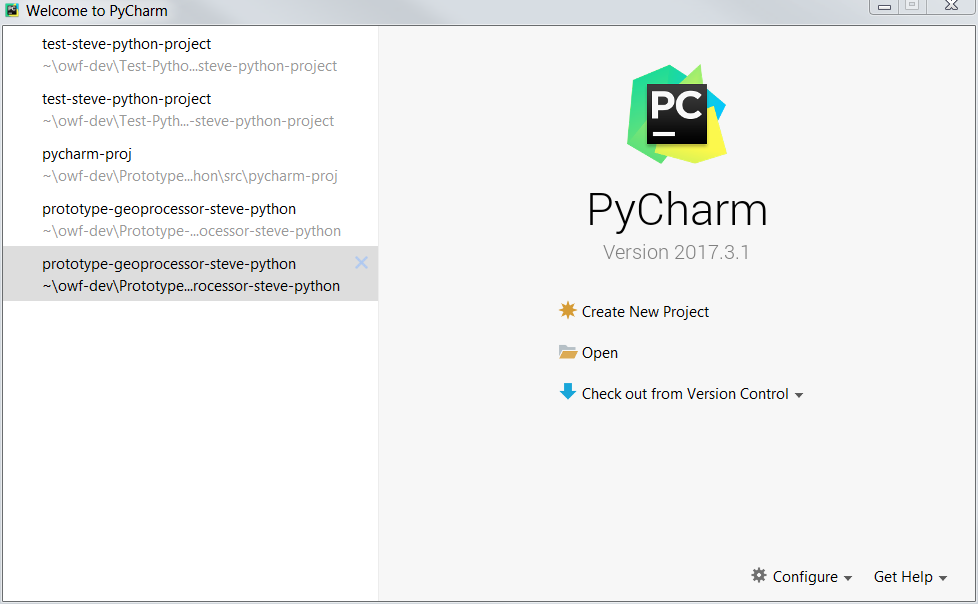
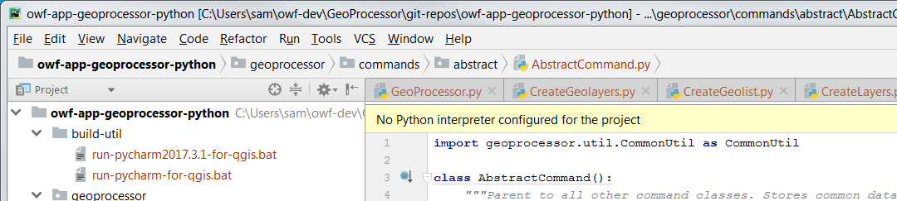

# GeoProcessor / New Developer #

This documentation explains how new developers can set up the development environment for the GeoProcessor software.
The Open Water Foundation focuses on developing the GeoProcessor on Windows 10,
with additional testing on other operating systems.
The following information focuses on Windows 10, with other operating systems described if they have been
used in development at OWF.
The development environment should be set up for each of the following software components.
Additional information for each tool is discussed in the [Development Environment](../dev-env/overview.md) section.

1. [Overview](#overview)
2. [Create Folders for Development](#create-folders-for-development)
3. [Install software](#install-software):
	1. [QGIS](#install-qgis) - provides PyQGIS Python library, QGIS UI, and command line tools
	2. [Python](#install-python) - used by GeoProcessor
	3. [PyCharm](#install-pycharm) - integrated development environment (IDE)
	4. [MkDocs](#install-mkdocs) - to create this documentation
	5. [Git](#install-git) - for version control
	6. [Cygwin](#install-cygwin) - used to automate tasks
4. [Setup GeoProcessor PyCharm Project](#setup-geoprocessor-pycharm-project) - the GeoProcessor code, tests, and documentation
	1. [Clone Repositories](#clone-repositories)
	2. [Start PyCharm](#start-pycharm)
	3. [Create New PyCharm Project](#create-new-pycharm-project)
	4. [Restart PyCharm using Run Script](#restart-pycharm-using-run-script)
	5. [Install Additional Python Packages](#install-additional-python-packages)
5. [Run the GeoProcessor](#run-the-geoprocessor)
	1. [Run with `gpdev.bat` Batch File](#run-with-gpdevbat-batch-file)
	2. [Run in PyCharm](#run-in-pycharm)
6. [Develop software as per Development Tasks](#develop-software-as-per-development-tasks)

-----------------

## Overview ##

The following diagram illustrates the GeoProcessor development and deployed environments.

**<p style="text-align: center;">

</p>**

**<p style="text-align: center;">
GeoProcessor / GGIS / Python Configuration (<a href="../images/gp-python-config.png">see full-size image</a>)
</p>**

Python virtual environments are used for both the development environment and deployed environment.
The virtual environments are initialized from the Python distributed with QGIS.
This results in completely-contained Python environments that are consistent with QGIS.

In order to protect the installed QGIS from corruption and third-party dependency conflicts,
the GeoProcessor Python modules and
third-party packages are installed in virtual environment `Lib/site-packages` folder,
rather than the similar QGIS Python folder.

The GeoProcessor `gpdev.bat` batch file runs the GeoProcessor in the development environment and
the GeoProcessor `gp.bat` batch file runs the GeoProcessor in deployed environment.
Development does occur within PyCharm, but using the `gpdev.bat` batch file to run the application
ensures that it is tested in a configuration that is similar to the deployed environment.

The above diagram illustrates how the QGIS version (in this case 3.10 - see orange text),
and Python version (in this case 3.7 - see blue text)
are consistent with development and deployed virtual environments.

## Create Folders for Development ##

Folders need to be created to hold the GeoProcessor development files.
Instructions are provided below for each step that folders need to be created.
See the following instructions and background information:

* [Development Environment Folders](../dev-env/folders.md) - overview of folder structure - **create top-level folders or wait until required below**
* [Clone Repository and Configure PyCharm Project](#clone-repository-and-configure-pycharm-project) - clone into recommended folders - **create folders when do this step below**

## Install Software ##

The following describes how to install software for the recommended development environment.
Separate [Development Environment](../dev-env/overview.md) documentation serves as a reference
and this section describes the sequential installation process.

### Install QGIS ###

Standalone QGIS should be installed for the version that is supported with the GeoProcessor.
It is OK to install multiple versions of standalone QGIS as long as the development environment is consistent.
Only one version of QGIS and corresponding Python are active at a time in the development environment,
in order to ensure feature compatibility.

QGIS is distributed with a version of Python, for example QGIS 3.x uses Python 3.x.
The QGIS Python and associated libraries are used by the deployed GeoProcessor.
GeoProcessor modules are installed in the `site-packages` folder of the GeoProcessor virtual environment and
are made known to the QGIS Python at runtime.

The following table summarizes the GeoProcessor version and important version information for configuration.
Verbose handling of QGIS and Python versions helps avoid confusion and allows automation scripts to
perform appropriate checks.

**<p style="text-align: center;">
GeoProcessor / QGIS / Python Versions
</p>**

| **GeoProcessor Version** | **QGIS Version** | **Python Version** | **PyCharm Venv** | **Deployed Folder** |
| -- | -- | -- | -- | -- |
| 1.3.x | 3.10 | 3.7 | `venv/venv-qgis-3.10-python37` | `gp-1.3.x-win-qgis-3.10-venv` |

Older versions of GeoProcessor are obsolete and are not important.
GeoProcessor 1.3 includes significant changes necessary to make the development
and deployed environment consistent and more robust.

See the following documentation for information about installing QGIS:

* [Development Environment / QGIS](../dev-env/qgis.md)

### Install Python ###

Multiple Python are typically installed as follows, if not already installed:

* Python 3.7 (or similar, depending on standalone QGIS version - determined from `PYTHONHOME` after running QGIS `py3_env.bat` setup batch file)
installed **with QGIS**, which will be used to initialize the Pycharm virtual environments:
	+ For PyCharm development virtual environment.
	+ For deployed virtual environment.
* Standard Python installation (typically the same version or close version to QGIS version),
used for MkDocs documentation.

See the following for information about installing Python:

* [Development Environment / Python](../dev-env/python.md)

### Install PyCharm ###

The PyCharm Community Edition integrated development (IDE) environment is used by the
Open Water Foundation to develop the GeoProcessor and is recommended for development.
Other IDEs such as Ecplipse/PyDev may work but have not been tested.

Using a PyCharm Python virtual environment is recommended for development to isolate GeoProcessor Python from the system/user Python.
The Python virtual environment should use a Python version consistent with QGIS as the base interpreter for the
PyCharm virtual environment.
The PyCharm Python virtual environment will be used to run the GeoProcessor in the development environment,
with QGIS libraries added via the `PYTHONPATH` environment variable in the PyCharm run script and `scripts` run scripts.
The [Overview section](#overview) provided a general explanation.
See the following for information about installing PyCharm:

* [Development Environment / PyCharm](../dev-env/pycharm.md)

Later sections of this documentation explain how to create a virtual environment and
configure a PyCharm project (**but don't do that yet**).

### Install MkDocs ###

MkDocs is used to create user and developer documentation, each as separate static websites.
See the following for information about installing MkDocs:

* [Development Environment / MkDocs](../dev-env/mkdocs.md)

### Install Git ###

Git and GitHub are used for version control.
GeoProcessor contributors are expected to have reasonably good Git skills.

See the following for information about installing Git:

* [Development Environment / Git](../dev-env/git.md)

### Install Cygwin ###

Cygwin provides a Linux-like environment on Windows that can be used to help with development.
Open Water Foundation developers use Cygwin to automate tasks and do command line tasks such as
file searches, creating test files, and running Git commands.

Cygwin has also been used to test Linux distributions of the GeoProcessor,
prior to testing on Linux operating system computers or virtual machines.

Alternatives such as Git for Bash and other environments are also appropriate but may require testing.

See the following for information about installing Cygwin:

* [Development Environment / Cygwin](../dev-env/cygwin.md)

## Setup GeoProcessor PyCharm Project ##

Once development environment software tools have been installed,
the GeoProcessor repositories can be cloned and PyCharm project can be created for development,
as explained in the following sections.

If necessary, a PyCharm project can be re-created multiple times in order to fix previous configuration issues
or add new configuations.
Make sure to commit to the Git repository or otherwise back up recent work.
If the project is configured consistent with this documentation and run scripts are used to start
PyCharm, run the GeoProcessor, and create installers, there should be few issues.
Issues that do arise will point out necessary changes to the development environment.

These instructions are consistent with the GeoProcessor repository
[README](https://github.com/OpenWaterFoundation/owf-app-geoprocessor-python) file.

### Clone Repositories ###

The GeoProcessor code project is maintained within a single GitHub repository.
Additional repositories are used for documentation and functional tests.
This allows progress to occur in all areas, while only requiring Python expertise in the code project.

Once set up, scripts within the project will determine the folder for the script and
use paths relative to the script folder.
The following folder structure is recommended for organizing the GeoProcessor project.
Each of the folders under `git-repos` matches the name of a GitHub repository.

```text
C:\Users\user\owf-dev\                         Top-level development folder (Windows).
/home/user/owf-dev/                            Top-level development folder (Linux).
/cygdrive/C/Users/user/owf-dev/                Top-level development folder (Cygwin).
  GeoProcessor or GP/                          Product folder (see note below).
    --------------- above line recommended, below line required -----------------------------------------------------
    git-repos/                                 Git repositories for the GeoProcessor.
      owf-app-geoprocessor-arcpy/              Code repository for ArcGIS version (only if developing ArcGIS version).
      owf-app-geoprocessor-python/             Code repository.
      owf-app-geoprocessor-python-doc-dev/     Developer documentation.
      owf-app-geoprocessor-python-doc-user/    User documentation.
      owf-app-geoprocessor-python-test/        Functional tests.
```

The following describes how to clone repositories into a new project.
Do not change the name of the repository when cloning because development
environment tools depend on the folder name matching the repository name.

1. Create a folder inclusive of the `git-repos` level, for example `C:\Users\user\owf-dev\GeoProcesor\git-repos`).
**Development environment scripts use `hashbang` (`#!`) paths that are limited to 127 characters.
If this limit is exceeded on a computer, use a shorter product-level
folder indicated above, such as `GP` rather than `GeoProcessor`, which may require re-initializing development environment files.
This may not be an obvious problem until running scripts in the testing framework.**
2. Clone the code component repository into `git-repos` folder as `owf-app-geoprocessor-python`.
3. Run the `build-util/git-clone-all-gp.sh` script to clone the other repositories
(repositories that already exist won't be re-cloned).

The `owf-app-geoprocessor-arcpy` project relies on Esri's ArcGIS Pro and is not needed for the QGIS GeoProcessor.
Additional information will be added later for the ArcGIS Pro version of the GeoProcessor.

### Start PyCharm ###

Because a new PyCharm project is being configured,
which initially has no knowlege of QGIS or GeoProcssor code, start PyCharm from the ***Start*** menu,
for example ***Start / JetBrains / JetBrains PyCharm Community Edition 2019.3.1***.

**Do not** run the PyCharm startup script that is typically used for GeoProcessor development.
This script will be used once the initial project is configured.

PyCharm will show the welcome screen (below).
If PyCharm has previously been used for GeoProcessor development or another project,
it may remember previous work rather than showing the welcome screen.

**<p style="text-align: center;">

</p>**

**<p style="text-align: center;">
PyCharm Startup Screen (<a href="../images/create-project1.png">see full-size image</a>)
</p>**

### Create New PyCharm Project ###

Once PyCharm is started, a new project can be configured.
This will rely on a Python virtual environment.

Select ***Create New Project*** from the welcome screen or ***File / New Project...***.
Then select the folder that was cloned from GitHub, similar to the following.
The `owf-app-geoprocessor-python` repository's `.gitignore` file indicates to ignore the PyCharm project files in the `.idea` folder
and also `venv` folder (and older `venv` folder variations used before the current convention was implemented). 
Only the code repository needs to be directly known to PyCharm.

The ***Python Interpreter:  New Virtualenv environment*** choice should be selected.
The QGIS Python version to be used for the ***Base interpreter*** should be that used for the target QGIS,
in this example `C:\Program Files\QGIS 3.10\apps\Python37\python.exe`.
Additional configuration (below) will be used to specify `PYTHONPATH` folders to PyCharm.

**<p style="text-align: center;">

</p>**

**<p style="text-align: center;">
Specify Python Interpreter for the Project (<a href="../images/create-project2.png">see full-size image</a>)
</p>**

PyCharm may display a warning because a new project is being created in a folder that contains existing files:

**<p style="text-align: center;">

</p>**

**<p style="text-align: center;">
New Project Warning for Existing Files (<a href="../images/create-project3.png">see full-size image</a>)
</p>**

Press ***Yes*** because the files from the cloned Git repository will be used for the project.
The project will be created/imported and the main PyCharm interface will be shown, with project files listed,
as shown in the following image.
Note that the project name in the upper left of the PyCharm project folders matches the Git existing repository name.

PyCharm may also display a prompt about how to open the PyCharm window, as shown below.
It is recommended to use ***This Window*** to avoid confusion with multiple PyCharm windows.

**<p style="text-align: center;">

</p>**

**<p style="text-align: center;">
New Project Question About New Window (<a href="../images/create-project3b.png">see full-size image</a>)
</p>**

If a warning is shown about no interpreter being configured as in the following figure,
an interpreter can be added as described below.
This appears to occur when the venv folder specified above empty.
**It is not clear why previous steps did not properly create the venv.**

**<p style="text-align: center;">

</p>**

**<p style="text-align: center;">
New Project after Git Repository Files are Imported (<a href="../images/create-project4.png">see full-size image</a>)
</p>**

To add an interpreter, use the ***File / Settings*** menu and then ***Project: owf-app-geoprocessor-python / Project Interpreter***.
Press ***Show All*** and then use the ***+*** on the right side to
indicate that a new environment should be used, which will create a virtual environment as shown in the following image
(which is similar to the configuration shown above).

**<p style="text-align: center;">

</p>**

**<p style="text-align: center;">
Specifying the Python Interpreter (<a href="../images/create-project5.png">see full-size image</a>)
</p>**

It appears that if a previous venv was created for the same project that PyCharm associates a ***(2)*** (or similar)
with the new venv, as shown in the following image.
Consequently, it may be necessary to do housecleaning on the virtual environments to remove those that are invalid
or duplicates.
**This does point out that trying to create multiple venv for different versions of QGIS within the same development environment may
be an issue and require duplicating the development environment in a separate top-level folder to avoid confusion.
This issue will be studied more as the GeoProcessor is udpated for new QGIS versions.**

**<p style="text-align: center;">

</p>**

**<p style="text-align: center;">
Numbered Virtual Environments (<a href="../images/create-project6.png">see full-size image</a>)
</p>**

Pressing ***OK*** will copy needed files from the base interpreter to the virtual environment.
The environment is then ready for development.
Use the [PyCharm run script](../dev-env/pycharm.md#script-to-run-pycharm)
each time that PyCharm needs to be started for development.

The virtual environment is configured with default packages as shown below.
Additional packages necessary for the GeoProcessor can be added as discussed in the next section

**<p style="text-align: center;">

</p>**

**<p style="text-align: center;">
Initial Virtual Environment Packages (<a href="../images/create-project7.png">see full-size image</a>)
</p>**

At this point the PyCharm interface should show code files.
However, there will be errors in import statements because:

1. PyQGIS and Qt modules are not know to the new PyCharm project.
2. Additional third party packages have not been installed in the virtual environment.

See the next section.

### Restart PyCharm using Run Script ###

The above sections showed how to initialize the PyCharm project.
However, PyCharm needs additional information to find necessary Python modules.
Rather than configuring this information in PyCharm,
the `build-util/run-pycharm-ce-for-qgis.bat` batch file (for Windows) is used to start PyCharm.
This batch file sets the `PYTHONHOME` variable to use QGIS Python (therefore the venv Python is not used)
and `PYTHONPATH` to include QGIS, GeoProcessor repository source files,
and venv `Lib/site-packages` for additional third-party packages.

See the following for more information about the run script:

* [Development Environment / PyCharm / Script to Run PyCharm](../dev-env/pycharm.md#script-to-run-pycharm)

### Install Additional Python Packages ###

Additional packages beyond QGIS and GeoProcessor Python modules are needed to fully load and run the GeoProcessor.

PyCharm will indicate missing files for imports and the GeoProcessor can also be tested by running.
Run the GeoProcessor from PyCharm by right-clicking on the `geoprocessor/app/gp.py` source file and select ***Run***.
The console should show warnings about missing packages because third party packages have not been added
to the PyCharm virtual environment.

See the following for instructions for installing additional packages in the PyCharm virtual environment:

* [Development Environment / Python / Packages Needed by GeoProcessor](../dev-env/python.md#packages-needed-by-geoprocessor)

Once installed the PyCharm environment should not indicate missing imports.
However, the software may still not run.  Additional configuration may be needed.
Instead, try running the `scripts/gpuidev.bat` batch file, which has typically been used to run and test the software.

## Run the GeoProcessor ##

See the [Development Environment / Running the GeoProcessor documentation](../dev-env/running.md)
for detailed information on running the GeoProcessor in the development environment.
The following summarizes this information.

###  Run with `gpdev.bat` Batch File ###

On Windows, the `scripts/gpuidev.bat` batch file (which calls `gpdev.bat`) is used to run the GeoProcessor UI in the development environment.
This script configures the environment to use the QGIS, Python, and Qt settings,
as well as GeoProcessor and third-party packages.
The `gpdev.bat` script closely matches the `gp.bat` file that is used for the deployed system,
except that `gpdev.bat` relies on development environment files rather than deployed GeoProcessor files.

### Run in PyCharm ###

**TODO smalers 2020-03-29 Need to complete this section once the other sections are updated.**

## Develop software as per Development Tasks ##

Once the development environment is set up, various development tasks can be performed
as per the [Development Tasks documentation](../dev-tasks/overview.md).
