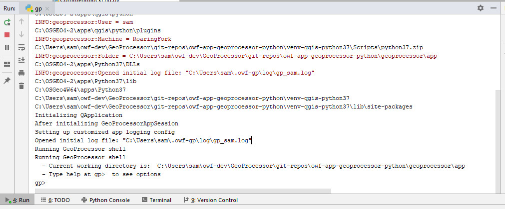

# GeoProcessor / Development Tasks / Running #

The GeoProcessor can be run in the development environment in several ways,
including interactive and batch mode.

*   [Introduction](#introduction)
*   [Running Interactively](#running-interactively)
    +   [Run Using Dev Scripts](#run-using-dev-scripts)
    +   [Run in PyCharm](#run-in-pycharm)
    +   [Run in Development Staging Virtual Environment](#run-in-development-staging-virtual-environment)
    +   [Run the Installer and Run the GeoProcessor](#run-the-installer-and-run-the-geoprocessor)

------------------

## Introduction ##

Developing the GeoProcessor involves using PyCharm to edit code,
and then running the GeoProcessor to test the code.
The code generally adheres to [PEP8 guidelines](https://www.python.org/dev/peps/pep-0008/)
and therefore most warnings indicated by PyCharm should be addressed.
For example, PyCharm displays a green checkmark if the file has no warnings.
The GeoProcessor code also implements type hints to help identify type issues.
PyCharm is particularly useful for identifying when import
statements are missing or inaccurate, based on `PYTHONPATH` value.

GeoProcessor automated tests can be run individually on in a test suite.
Typically, code related to a bug fix or new feature is worked on iteratively,
running tests after code is changed until the functionality is as expected.
The following sections describe how to run the GeoProcessor.

## Running Interactively ##

Running the GeoProcessor interactively is an effective way to develop new features while also testing the UI.
This helps ensure that the GeoProcessor works and issues don't slip through.
Running the UI also exercises UI code that is difficult to test with the
automated tests, which focus on testing computational code.
Repetitive use also helps the software developer identify user experience issues including:

*   inefficiencies related to bad design
*   repetitive multi-step sequences
*   confusing features
*   functionality limitations
*   performance issues

The following sections describe how to run the GeoProcessor interactively in various environments.

### Run Using Dev Scripts ###

This approach is the most efficient way to run the GeoProcessor in the developer environment
because the original source files are used directly,
without PyCharm being involved.

The GeoProcessor can be run in the development environment by running the following batch files in a Windows command shell window.

*   `scripts/gpdev.bat` - run command file in batch mode, for example for automated tests
*   `scripts/gpuidev.bat` - start the GeoProcessor UI

The `gpuidev.bat` batch file calls the `gpdev.bat` file with `--ui` option, which is passed to the Python `gp.py` script.
Use the `/h` option to see the usage of the scripts.
The batch files configure the command shell the first time they are run and then the window can be used to re-run the batch files.
For example, environment variables that use a path are configured the first time
so that the `PATH` environment variable does not get longer and longer each time the script is run.

The title of the window is changed to indicate its use, to avoid confusion with other windows that may be opened.

### Run in PyCharm ###

The GeoProcessor can be run from within the PyCharm IDE.
For example, right click on the `geoprocessor/app/gp.py` file in the ***Project*** view
and select ***Run 'gp'***.
However, the default run mode is to start the command line interpreter with `gp>` prompt,
which may not be the most desirable way to start the GeoProcessor.
The following image illustrates the GeoProcessor interpreter that is accessible in the PyCharm ***Run*** tab.

**

GeoProcessor Running in PyCharm (<a href="../images/running-in-pycharm.png">see full-size image</a>)

**

The PyCharm ***Run*** tab can be used to enter GeoProcessor interpreter commands such as `ui` to start the user interface.

Running in Python may be better suited for tasks such as using the debugger.

It should be possible to define a run profile to run the UI directly (**need to implement**).

If there are errors, see the [Troubleshooting](../troubleshooting/troubleshooting.md) documentation.

### Run in Development Staging Virtual Environment ###

The [Development Tasks / Creating Installer](creating-installer.md) documentation
describes how to create the GeoProcessor installer.
During this process, a "staging" virtual environment is created,
and the GeoProcessor software can be run to test the software before final installer is created.

To run the software in the development staging virtual environment:

1.  For Windows, open a Windows command prompt window.
2.  Change to the appropriate folder such as `venv-tmp/gptest-1.3.0-win-qgis-3.10-venv/scripts` for Windows and QGIS 3.10.
    Virtual environments are created for each operating system and QGIS version.
3.  Run the appropriate script:
    1.  `gpui.bat` to run the GeoProcessor in user interface mode on Windows.
    2.  `gp.bat` to run the GeoProcessor in batch mode.

### Run the Installer and Run the GeoProcessor ###

To fully test the GeoProcessor, download and install the GeoProcessor software, and then run in the deployed environment.
See the [GeoProcessor Downloads page](http://software.openwaterfoundation.org/geoprocessor/).

Then run `Scripts/gpui.bat` to start the UI.
