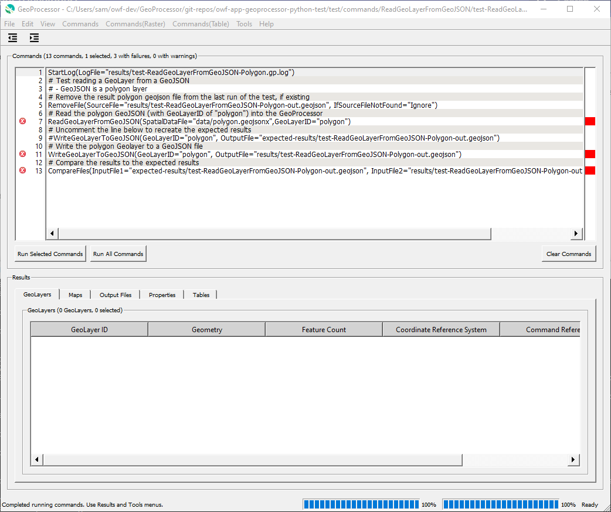

# GeoProcessor / Introduction #

*   [Introduction](#introduction)
*   [GeoProcessor Features](#geoprocessor-features)
*   [GeoProcessor Open Source Project](#geoprocessor-open-source-project)

---------------

## Introduction ##

There is often a need to automate processing of spatial data, ranging from simple to complex tasks.
For example, the Open Water Foundation often processes spatial data related to water resources and land use,
such as processing river basin data to better understand water resources issues.
Although open source (e.g., QGIS) and commercial (e.g., Esri ArcGIS)
Geographic Information Systems (GIS) software tools are available,
the features of these tools are limited and in some cases are expensive to purchase.
There is a need for tools that can automate spatial data processing without requiring extensive GIS skills.
The OWF GeoProcessor software is intended to address this need.

## GeoProcessor Features ##

The GeoProcessor provides a command language for automating geospatial data processing in workflows.
This allows processing to be efficiently repeated and workflows can be shared between GeoProcessor software users.
Workflows can be maintained in version control.

The following image illustrates the main GeoProcessor interface.
The upper part of the interface is used to edit and run the command workflow.
The bottom part of the interface provides access to the results of processing.
Issues with the workflow are indicated with colored indicators and icons, with access to diagnostic messages.
Automated tests are developed using small command files.
Therefore GeoProcessor tests can be created by software developers and users.

**

**

**

GeoProcessor Main Window (<a href="../GeoProcessor-main.png">see full-size image</a>)

**

See the [GeoProcessor documentation for users](http://software.openwaterfoundation.org/geoprocessor/latest/doc-user/),
which explains the GeoProcessor software features.

## GeoProcessor Open Source Project ##

The Open Water Foundation is involved in multiple open source software projects that
seek to increase access to data and improve transparency on complex water issues.

The GeoProcessor is one of the first major projects that OWF has undertaken as an independent OWF product.
The goal is to provide a significant new option for geoprocessing software that leverages and enhances
existing GIS platforms including QGIS and ArcGIS Pro.
OWF seeks and accepts funding to enhance the software, provide training,
and implement the software on projects.

OWF has has developed similar open source software to process time series
(see the TSTool software download page on the [OpenCDSS website](http://opencdss.state.co.us/opencdss/tstool/)).
It is OWF's intent to develop the GeoProcessor in a way that can be used in parallel with TSTool to
automate analyses for complex water issues.
The design of GeoProcessor (Python) and TSTool (Java) are similar,
with differences due to language differences and lessons learned.

Use the [GeoProcessor repository issues page](https://github.com/OpenWaterFoundation/owf-app-geoprocessor-python/issues)
or contact project maintainers to provide input.
