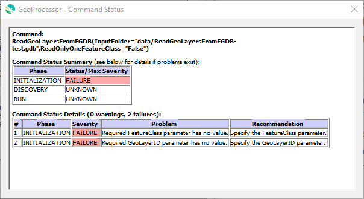

# GeoProcessor / Software Design #

The GeoProcessor software design leverages Python features and best practices
while incorporating TSTool design elements.

* [GeoProcessor Design Background](#geoprocessor-design-background) - general background
* [Command File and Command Syntax](#command-file-and-command-syntax) - the user-facing representation of commands and workflow
* [QGIS Environment and Run Scripts](#qgis-environment-and-run-scripts) - running the application
* [`gp` Application](#gp-application) - application to manage using `GeoProcessor` class instance in different run modes
* [`GeoProcessor` Class](#geoprocessor-class) - the core class that runs GeoProcessor command workflows
* [`GeoProcessorCommandFactory` Class](#geoprocessorcommandfactory-class) - creates command instances from text command
* [`AbstractCommand` and Command Classes](#abstractcommand-and-command-classes) - classes that perform specific processing
* [`CommandStatus` Class](#commandstatus-class) - used to track issues with commands
* [Utility Modules](#utility-modules) - utility code
* [Logging](#logging) - logging processing progress
* [`GeoLayer` Class](#geolayer-class) - main class for storing vector and raster layers
* [`GeoProcessorUI` Class](#geoprocessor-class) - user interface
* [`GeoMap` Class](#geomap-class) - describes maps
* [`GeoMapProject` Class](#geomapproject-class) - describes map projects (one or more related maps)
* [Built-in Test Framework](#built-in-test-framework) - used to run functional tests
* [Future Design Elements](#future-design-elements) - as-yet implemented features

----------------------

## GeoProcessor Design Background ##

This GeoProcessor software leverages the Python geoprocessing libraries from QGIS
while implementing the command/workflow feature
design developed in the [TSTool time series processing software](http://opencdss.state.co.us/opencdss/tstool/).
Many lessons were learned developing TSTool that have been applied to the GeoProcessor.

The GeoProcessor is written for Python 3 because current QGIS libraries use Python 3.
The Python language continues to evolve and the GeoProcessor will be updated accordingly.

TSTool is written in Java, is object-oriented and has a modular design.
Although Python provides object-oriented features via classes,
there are differences between Java and Python, in particular:

* Java does not support multiple inheritance and Python does.
* Java supports interfaces and Python does not (natively).
* Java provides enumerations but Python 3 enumerations are not as flexible.
* Java provides private and public levels whereas Python generally leans toward public data
and using conventions such as `__` prefix on data and functions to indicate private data.
* Java concepts of static classes is paralleled by Python `@classmethod`, `@staticmethod` and module functions.

The TSTool design has been adapted from Java to Python.
In many cases, the Java code has been simplified in order to streamline GeoProcessor development
and to evaluate options to improve/simplify the original Java design.  For example, simplifications include:

* Specific exceptions in Java code have been simplified to use built-in Python `ValueError` for checking input
and `RuntimeError` for run-time errors.
Additional exception classes may be used but a simple design that works will win out.
* Java class setter/getter methods have been omitted in favor of Pythonic direct-access to data
(exceptions are cases when more robust error checks are needed).
Class constructors with instance data are used to create object instances.

The following sections describe specific components by explaining GeoProcessor classes.
Links to code on the master branch of the repository are provided.
Right-click on the link and view in a separate window to facilitate review
of the documentation and code at the same time.

## Command File and Command Syntax ##

The GeoProcessor performs its work by interpreting a workflow of commands.
A command file is text file containing lines with one command per line.
For example, see any of the command files with names ending in `.gp` in the
[automated tests](https://github.com/OpenWaterFoundation/owf-app-geoprocessor-python-test/tree/master/test/commands).
The following is a simple command file for a example:

```
StartLog(LogFile="results/test-ReadGeoLayerFromGeoJSON-Polygon.gp.log")
# Test reading a GeoLayer from a GeoJSON
# - GeoJSON is a polygon layer
# Remove the result polygon geojson file from the last run of the test, if existing
RemoveFile(SourceFile="results/test-ReadGeoLayerFromGeoJSON-Polygon-out.geojson", IfSourceFileNotFound="Ignore")
# Read the polygon GeoJSON (with GeoLayerID of "polygon") into the GeoProcessor
ReadGeoLayerFromGeoJSON(SpatialDataFile="data/polygon.geojson", GeoLayerID="polygon")
# Uncomment the line below to recreate the expected results
#WriteGeoLayerToGeoJSON(GeoLayerID="polygon", OutputFile="expected-results/test-ReadGeoLayerFromGeoJSON-Polygon-out.geojson")
# Write the polygon Geolayer to a GeoJSON file
WriteGeoLayerToGeoJSON(GeoLayerID="polygon", OutputFile="results/test-ReadGeoLayerFromGeoJSON-Polygon-out.geojson")
# Compare the results to the expected results
CompareFiles(InputFile1="expected-results/test-ReadGeoLayerFromGeoJSON-Polygon-out.geojson", InputFile2="results/test-ReadGeoLayerFromGeoJSON-Polygon-out.geojson",IfDifferent="Warn")
```

The command file lines include:

* One-line comments starting with `#` character (multiple sequential comment lines can be used for longer comments).
* Indentation is OK.
* Blank lines.
* Control commands including `For` and `If`.
* Commands that follow syntax:

```text
CommandName(Parameter1="Value1",Parameter2="Value2",...)
```

Conventions for commands and command files are described in the
[GeoProcessor user documentation](http://software.openwaterfoundation.org/geoprocessor/latest/doc-user/).

## QGIS Environment and Run Scripts ##

The GeoProcessor relies on the QGIS environment and Python libraries.
In particular, the following are used:

* QGIS runtime environment, initialized before running applications such as the [`gp` application](#gp-application) (discussed below).
* QGIS Python processing algorithms and plugins, used in [Command classes](#abstractcommand-and-command-classes) (discussed below).
* Qt5 graphical user interface library, used in the [`GeoProcessorUI` class user interface](#geoprocessorui-class) (discussed below).

In order to use the QGIS environment in the deployed environment (including `gp` application variants),
the GeoProcessor runs the Python software distributed with QGIS,
with `PYTHONPATH` configured to find GeoProcessor modules.
In the PyCharm development virtual environment, PyCharm uses the project Python interpreter and
relies on `PYTHONPATH` to find QGIS libraries.

* To start PyCharm in the **developer environment**, run the setup batch file from Windows command prompt: 
[`build-util/run-pycharm-ce-for-qgis.bat`](https://github.com/OpenWaterFoundation/owf-app-geoprocessor-python/tree/master/build-util/run-pycharm-ce-for-qgis.bat).
	+ This batch file runs the QGIS `ow4_env.bat` batch file and performs additional configuration.
	+ The batch file searches for recent versions of PyCharm and QGIS to try to use most recent tested versions.
* To run the GeoProcessor in the **development environment**, run one of the following `dev` scripts,
which look for files in the development environment.
Each of these start Python and run the
[`geoprocessor/app/gp.py`](https://github.com/OpenWaterFoundation/owf-app-geoprocessor-python/blob/master/geoprocessor/app/gp.py)
module as the entry-point into the Python GeoProcessor application (see next section).
The scripts run similar setup steps as the develop environment script.

| **Windows** | **Linux** | **Description** |
| -- | -- | -- |
| [`gpdev.bat`](https://github.com/OpenWaterFoundation/owf-app-geoprocessor-python/blob/master/scripts/gpdev.bat) | [`gpdev`](https://github.com/OpenWaterFoundation/owf-app-geoprocessor-python/blob/master/scripts/gpdev) | Run GeoProcessor in batch mode (command line). |
| [`gpuidev.bat`](https://github.com/OpenWaterFoundation/owf-app-geoprocessor-python/blob/master/scripts/gpuidev.bat) | [`gpuidev`](https://github.com/OpenWaterFoundation/owf-app-geoprocessor-python/blob/master/scripts/gpuidev) | Run GeoProcessor user interface. |

* To run the GeoProcessor in the **deployed Python virtual environment**, run one of the following.
Each of these start Python and run the
[`geoprocessor/app/gp.py`](https://github.com/OpenWaterFoundation/owf-app-geoprocessor-python/blob/master/geoprocessor/app/gp.py)
module as the entry-point into the Python GeoProcessor application (see next section).
The scripts run similar setup steps as the develop environment script.

| **Windows** | **Linux** | **Description** |
| -- | -- | -- |
| [`gp.bat`](https://github.com/OpenWaterFoundation/owf-app-geoprocessor-python/blob/master/scripts/gp.bat) | [`gp`](https://github.com/OpenWaterFoundation/owf-app-geoprocessor-python/blob/master/scripts/gp) | Run GeoProcessor in batch mode (command line). |
| [`gpui.bat`](https://github.com/OpenWaterFoundation/owf-app-geoprocessor-python/blob/master/scripts/gpui.bat) | [`gpui`](https://github.com/OpenWaterFoundation/owf-app-geoprocessor-python/blob/master/scripts/gpui) | Run GeoProcessor user interface. |

## gp Application ##

The
[`geoprocessor.app.gp`](https://github.com/OpenWaterFoundation/owf-app-geoprocessor-python/blob/master/geoprocessor/app/gp.py)
module contains the main program to run the GeoProcessor in multiple modes:

* default interactive command shell, when no command parameters are given
* batch mode via `--commands command-file.gp` command parameter
* user interface mode via `--ui` command parameter
* http server (future feature to support web service functionality)

This module serves as the primary tool for running the GeoProcessor and is expected to be enhanced over time.
The Python module is run using one of the scripts described in the previous section and other scripts
found in the [`scripts/`](https://github.com/OpenWaterFoundation/owf-app-geoprocessor-python/blob/master/scripts) folder.

The `gp` module will create a `GeoProcessor` or `GeoProcessorUI` class to start the GeoProcessor depending on the run mode.
These classes are discussed in the following sections.

## `GeoProcessor` Class ##

The
[`geoprocessor.core.GeoProcessor`](https://github.com/OpenWaterFoundation/owf-app-geoprocessor-python/blob/master/geoprocessor/core/GeoProcessor.py)
class forms the core of the GeoProcessor package.
The GeoProcessor provides the following design elements and functionality.
An instance is created to maintain a list of commands and run the commands.
The following are the primary `GeoProcessor` data members,
which are typically accessed and updated directly in typical Pythonic fashion.
The primary data are also listed in the ***Results*** area of the UI.

| **GeoProcessor Data Object**&nbsp;&nbsp;&nbsp;&nbsp;&nbsp;&nbsp;&nbsp;&nbsp; | **Description** |
| -- | -- |
| `commands` | List of command class objects, which are expected to extend from [`AbstractCommand`](https://github.com/OpenWaterFoundation/owf-app-geoprocessor-python/blob/master/geoprocessor/commands/abstract/AbstractCommand.py) class ([discussed below](#abstractcommand-and-command-classes)). |
| `datastores` | A list of `DataStore` objects, which are created by the processor for database connections. |
| `geolayers` | A list of `GeoLayer` objects, which are created by the processor for vector (`VectorGeoLayer`) and raster (`RasterGeoLayer`) spatial data layer objects. |
| `geomaps` | A list of `GeoMap` objects, which are created by the processor to describe maps. |
| `geomapprojects` | A list of `GeoMapProject` objects, which are created by the processor to describe groups of maps. |
| `properties` | Dictionary of property objects for use by the processor, for example string that contains the working directory. |
| `output_files` | A list of output files, which are created by the processor during processing. |
| `tables` | A list of `Table` objects, which are created by the processor for data tables. |

The following are important `GeoProcessor` class functions:

| **Function**&nbsp;&nbsp;&nbsp;&nbsp;&nbsp;&nbsp;&nbsp;&nbsp;&nbsp;&nbsp;&nbsp;&nbsp;&nbsp;&nbsp;&nbsp;&nbsp;&nbsp;&nbsp;&nbsp;&nbsp;&nbsp;&nbsp;&nbsp;&nbsp;&nbsp;&nbsp;&nbsp;&nbsp;&nbsp;&nbsp;&nbsp;&nbsp; | **Description** |
| -- | -- |
| `read_command_file` | Read a command file and instantiates command objects. |
| `run_commands` | Run the commands in the processor list (or a subset of commands. |)
| `expand_parameter_value` | Processes command parameter strings that include `${Property}` syntax into expanded strings, using the list of processor properties - this supports dynamic processing features such as for loops and parameters that reflect shared properties. |
| `get_property` | Returns a processor property and also gracefully handles missing properties so that calling code can be more direct. |
| `set_property` | Utility function to set a property in the dictionary. |

A GeoProcessor instance can be created to run a command file in batch mode,
for example when using the
[`CommandFileRunner`](https://github.com/OpenWaterFoundation/owf-app-geoprocessor-python/blob/master/geoprocessor/core/CommandFileRunner.py) class.
An instance is also be used by the user interface to interactively edit and run commands,
which can also be saved to a command file. 

## `GeoProcessorCommandFactory` Class ##

The
[`GeoProcessorCommandFactory`](https://github.com/OpenWaterFoundation/owf-app-geoprocessor-python/blob/master/geoprocessor/core/GeoProcessorCommandFactory.py)
class examines a command string and instantiates a corresponding command class of the proper type.
This occurs through a simple lookup to identify the proper command and then calling the
constructor (`__init__()` function is called as per normal Python object initialization) for the matching command,
for example:

```text
elif command_name_upper == "SETPROPERTY":
    return SetProperty()

```

The returned command is not fully parsed by the command factory - that step occurs as necessary in other code,
for example the `GeoProcessor.read_command_file` function.
or in the user interface after a command string has been created via a command editor.
To parse and initialize the command, code like the following is used:

```
# Initialize the parameters of the command object.
# Work is done in the AbstractCommand class.
command_object.initialize_command(command_file_string, self, True)
```

## `AbstractCommand` and Command Classes ##

The
[`AbstractCommand`](https://github.com/OpenWaterFoundation/owf-app-geoprocessor-python/blob/master/geoprocessor/commands/abstract/AbstractCommand.py)
class provides common command features.  All commands are expected to extend this class.
An instance is created for each command in a command file.
The commands are processed by the `GeoProcessor` and are maintained in the
[`GeoProcessorListModel`](https://github.com/OpenWaterFoundation/owf-app-geoprocessor-python/blob/master/geoprocessor/ui/core/GeoProcessorListModel.py) data model class.

The `GeoProcessorUI` manipulates commands through the `GeoProcessorListModel` class (such as creating new commands, deleting commands, and cut/copy/paste).
The `GeoProcessor` runs the commands and produces output in the `GeoProcessor` object lists.
The following are important `AbstractCommand` data members, which should be set in child classes.

| **AbstractCommand Data Object**&nbsp;&nbsp;&nbsp;&nbsp;&nbsp;&nbsp;&nbsp;&nbsp;&nbsp;&nbsp;&nbsp;&nbsp;&nbsp;&nbsp;&nbsp;&nbsp;&nbsp;&nbsp;&nbsp;&nbsp;&nbsp;&nbsp;&nbsp;&nbsp;&nbsp;&nbsp;&nbsp;&nbsp;&nbsp;&nbsp;&nbsp;&nbsp;&nbsp;&nbsp;&nbsp;&nbsp;&nbsp;&nbsp;&nbsp;&nbsp;&nbsp;&nbsp;&nbsp;&nbsp; | **Description** |
| -- | -- |
| `command_string` | Full command string, including leading indentation spaces. |
| `command_metadata` | Command main metadata including description and type of editor to use. |
| `command_name` | Command name, the command string before the left-most `(`.  Special commands such as `#` comment use string `#`, etc. |
| `command_processor` | The `GeoProcessor` instance that is managing the command - this allows the command to retrieve processor data such as GeoLayers to process within the command, and to save output back to the processor. |
| `command_parameters` | Dictionary of command parameters, corresponding to values in the `(parameter=value,...)` command string.<ul><li>the key matches the parameter name</li><li>values are the parameter value **as a string (not parsed object type)**.  Strings are used to ensure clean conversion between edited values and command file values, and to allow use of `${Property}` notation for all parameter value types.  Strings are converted to necessary object representations when running commands.</li></ul> |
| `command_parameter_metadata` | List of [`CommandParameterMetadata`](https://github.com/OpenWaterFoundation/owf-app-geoprocessor-python/blob/master/geoprocessor/core/CommandParameterMetadata.py), which provides information that allows checking for valid parameter names and types, shared between class instances. |
| `command_status` | Instance of [`CommandStatus`](https://github.com/OpenWaterFoundation/owf-app-geoprocessor-python/blob/master/geoprocessor/core/CommandStatus.py) ([discussed below](#commandstatus-class)), which maintains a list of `CommandLogRecord`, used to track issues in initializing and running commands (see discussion below). |
| `geoprocessor_ui` | Reference to the [`GeoProcesorUI`](https://github.com/OpenWaterFoundation/owf-app-geoprocessor-python/blob/master/geoprocessor/ui/app/GeoProcessorUI.py) ([discussed below](#geoprocessorui-class)), used by some commands.  **This needs to be redesigned to avoid UI dependency.** |
| `parameter_input_metadata` | Dictionary of properties to define the user interface to edit the parameters in the command editor.  See the [`GeoProcessorUI`](#geoprocessor-class) class.|

Important `AbstractCommand` class functions include the following.  The indicated functions should be defined in each child command class. 

| **Function**&nbsp;&nbsp;&nbsp;&nbsp;&nbsp;&nbsp;&nbsp;&nbsp;&nbsp;&nbsp;&nbsp;&nbsp;&nbsp;&nbsp;&nbsp;&nbsp;&nbsp;&nbsp;&nbsp;&nbsp;&nbsp;&nbsp;&nbsp;&nbsp;&nbsp;&nbsp;&nbsp;&nbsp;&nbsp;&nbsp;&nbsp;&nbsp;&nbsp;&nbsp;&nbsp;&nbsp; | **Define in Child Class?** | **Description** |
| -- | -- | -- |
| `check_command_parameters` | Yes | Validate command parameter values during command initialization. |
| `get_parameter_metadata` | | Utility function to return the metadata for a parameter name. |
| `get_parameter_value` | | Utility function to return a parameter string value from the parameter dictionary, gracefully handles missing parameters. |
| `initialize_command` | | Utility function that is called to:<ul><li>set the `GeoProcessor` instance</li><li>set the command string</li><li>optionally parse the command string into parameter string dictionary</li></ul> |
| `parse_command` | | Utility function to parse the command string into parameter string dictionary. |
| `run_command` | Yes | Run the command. |
| `to_string` | | Utility function to convert the internal parameter string dictionary into the single-line command string. |

The `AbstractCommand` class is the parent class from which all other commands are derived.
Specific commands are organized in groups under the `geoprocessor.commands` package,
for example, the `geoprocessor.commands.running` package contains commands that are associated with
controlling running commands.

* See the [Command Reference Overview in User Documentation](http://software.openwaterfoundation.org/geoprocessor/latest/doc-user/command-ref/overview/)

Command class design considerations include:

* One class is stored per source file and the name of the file matches the class name.
* Command instances are created for each line in a command file:
	+ [`UnknownCommand`](https://github.com/OpenWaterFoundation/owf-app-geoprocessor-python/blob/master/geoprocessor/commands/util/UnknownCommand.py)
	is used when the command name is not recognized by the `GeoProcessorCommandFactory`.
	+ [`Blank`](https://github.com/OpenWaterFoundation/owf-app-geoprocessor-python/blob/master/geoprocessor/commands/util/Blank.py)
	is used as a place-holder for empty lines.
	+ [`Comment`](https://github.com/OpenWaterFoundation/owf-app-geoprocessor-python/blob/master/geoprocessor/commands/util/Comment.py)
	is used for `#` comments.
* Data:
	+ Private data values should be defined as needed; however, in most cases data local to functions may be adequate
	because the GeoProcessor instance maintains primate data like the list of GeoLayers
	+ `command_name` from `AbstractCommand` is set to the command name
	+ `command_parameter_metadata` from `AbstractCommand` is set to the command parameter metadata 
* Functions:
	+ `check_command_parameters` - checks command parameter values at initialization for valid values
		- required parameters must be defined
		- parameter string values are checked for validity using `geoprocessor.util.validators` module functions.
		- adds `CommandStatus` messages for `command_phase_type.INITIALIZATION` run phase
		- **DOES NOT** do checks at runtime
	+ `run_command` - executes the functionality of the command
		- parameters containing `${Property}` notation are expanded to full values prior to use using the
		GeoProcessor `expand_parameter_value` function
		- file/folder parameters are converted to absolute paths using the processor `WorkingDir` property
		using `geoprocessor.util.io.to_absolute_path` function
		- converts string parameter dictionary values into object types needed for run-time, raising `ValueError` if any issues
		- performs run-time parameter checks to reflect that parameter values and data are dynamic
		(see for example the check functions found in the `run_command` method in
		[`CopyGeoLayer`](https://github.com/OpenWaterFoundation/owf-app-geoprocessor-python/blob/master/geoprocessor/commands/layers/CopyGeoLayer.py) command).
		- performs the processing
		- saves results such as output GeoLayers back to the GeoProcessor, if the command generates results
		- raises `RuntimeError` if an error
		- adds `CommandStatus` messages for `command_phase_type.RUN` run phase

## `CommandStatus` Class ##

The
[`AbstractCommand`](https://github.com/OpenWaterFoundation/owf-app-geoprocessor-python/blob/master/geoprocessor/commands/abstract/AbstractCommand.py)
class includes the `command_status` data object, which is an instance of
[`CommandStatus`](https://github.com/OpenWaterFoundation/owf-app-geoprocessor-python/blob/master/geoprocessor/core/CommandStatus.py).
This object maintains a list of 
[`CommandLogRecord`](https://github.com/OpenWaterFoundation/owf-app-geoprocessor-python/blob/master/geoprocessor/core/CommandLogRecord.py),
which allows tracking issues with command initialization, discovery, and run command phase types.
Populating log messages at a command level is key to providing pinpoint diagnostics used in the UI and
creating command file run reports with
[`WriteCommandSummaryToFile`](http://software.openwaterfoundation.org/geoprocessor/latest/doc-user/command-ref/WriteCommandSummaryToFile/WriteCommandSummaryToFile) command.
The command log messages are displayed by right-clicking on a command and using the ***Show Command Status*** menu item, as illustrated in the following figure.

**<p style="text-align: center;">

</p>**

**<p style="text-align: center;">
Command Status(<a href="../images/command-status.png">see full-size image</a>)
</p>**

The initialization command log messages are created when a command file is loaded or new commands are added in the UI,
via each command's `check_command_parameters()` function.
The run command log messages are created in each command's `run_command()` function.
The GeoProcessor currently does not implement the discovery phase,
which in TSTool is used to partially run commands in order to provide lists of objects to facilitate editing,
so that identifiers can be picked from lists rather than being entered into text fields.
Discovery mode may be implemented in the future to minimize keyboard entry,
which can increase efficiency and help minimize input errors.

The following is an example of setting the command status in the `check_command_parameters` function via the `add_to_log` function:

```python
pv_PropertyType = self.get_parameter_value(parameter_name='PropertyType', command_parameters=command_parameters)
property_types = ["bool", "float", "int", "long", "str"]
if not validators.validate_string_in_list(pv_PropertyType, property_types, False, False):
    message = 'The requested property type "' + pv_PropertyType + '"" is invalid.'
    warning += "\n" + message
    self.command_status.add_to_log(
        command_phase_type.INITIALIZATION,
        CommandLogRecord(command_status_type.FAILURE, message, "Specify a valid property type:  " +
                         str(property_types)))
```

The following is an example of setting the command status in the `run_command` function:

```python
except Exception as e:
    ++warning_count
    message = 'Unexpected error setting property "' + pv_PropertyName + '"'
    logger.exception(message, e)
    self.command_status.add_to_log(
        command_phase_type.RUN,
        CommandLogRecord(command_status_type.FAILURE, message,
                         "Check the log file for details."))
```

## Utility Modules ##

The `geoprocessor.util` package includes utility modules with functions that can be called from
classes and other code to perform useful tasks.
These modules and additional utility modules will be enhanced over time.

| **Utility Module** | **Description** |
| -- | -- |
| [`app_util`](https://github.com/OpenWaterFoundation/owf-app-geoprocessor-python/blob/master/geoprocessor/util/app_util.py) | Application global data. |
| [`command_util`](https://github.com/OpenWaterFoundation/owf-app-geoprocessor-python/blob/master/geoprocessor/util/command_util.py) | Command parsing, etc. |
| [`gdal_util`](https://github.com/OpenWaterFoundation/owf-app-geoprocessor-python/blob/master/geoprocessor/util/gdal_util.py) | Utility functions to run GDAL programs. |
| [`io_util`](https://github.com/OpenWaterFoundation/owf-app-geoprocessor-python/blob/master/geoprocessor/util/io_util.py) | Input/output. |
| [`log_util`](https://github.com/OpenWaterFoundation/owf-app-geoprocessor-python/blob/master/geoprocessor/util/log_util.py) | Log file handling. |
| [`os_util`](https://github.com/OpenWaterFoundation/owf-app-geoprocessor-python/blob/master/geoprocessor/util/os_util.py) | Operating system functions. |
| [`pandas_util`](https://github.com/OpenWaterFoundation/owf-app-geoprocessor-python/blob/master/geoprocessor/util/pandas_util.py) | Pandas package functions. |
| [`qgis_util`](https://github.com/OpenWaterFoundation/owf-app-geoprocessor-python/blob/master/geoprocessor/util/qgis_util.py) | Code specific to QGIS. |
| [`string_util`](https://github.com/OpenWaterFoundation/owf-app-geoprocessor-python/blob/master/geoprocessor/util/string_util.py) | String processing. |
| [`validator_util`](https://github.com/OpenWaterFoundation/owf-app-geoprocessor-python/blob/master/geoprocessor/util/validator_util.py) | Validators for command parameters. |
| [`zip_util`](https://github.com/OpenWaterFoundation/owf-app-geoprocessor-python/blob/master/geoprocessor/util/zip_util.py) | Zip file processing. |

## Logging ##

The GeoProcessor modules uses standard Python `logging` module features
in order to support troubleshooting.
However, the log file is not simple for users to interpret and the final software user interface
will provide features to view command status using the
[`CommandStatus`](https://github.com/OpenWaterFoundation/owf-app-geoprocessor-python/blob/master/geoprocessor/core/CommandStatus.py) data.
Additional guidance on logging topics is provided below.

### Log File ###

The `geoprocessor.app.gp` module contains a main program to run the GeoProcessor.
This program starts an initial log file at `INFO` level in the user's home folder,
for example on Windows `C:\Users\user\.owf-gp\1\logs\gp_user.log`, where `1` is the GeoProcessor major version and `user` is the specific user.

The [`StartLog`](http://software.openwaterfoundation.org/geoprocessor/latest/doc-user/command-ref/StartLog/StartLog)
command restarts the log file using a specified file.
For example, a log file in the same folder as the command file is typically used
to record processing progress.

The [`geoprocessor.util.log_util`](https://github.com/OpenWaterFoundation/owf-app-geoprocessor-python/blob/master/geoprocessor/util/log_util.py)
module contains functions that start the initial log file and reset.
The logging handler is setup with name `geoprocessor` so as to be in effect for all subpackages.

### Log Messages ###

GeoProcessor code modules call Python logging functions using standard Python conventions,
for example:

```python
        logger = logging.getLogger(__name__)

        logger.debug(...)
        logger.info(...)
        logger.warning(...)
        logger.error(...)
        logger.critical(...)
```

The formatter for log messages provides useful data for troubleshooting.

Care should be taken to minimize logging once initial development is complete
so that the log file size is kept as small as possible.

### Logger Exception Handling ###

Python exception handling can be painful given transition of the language in implementing
specific exception classes, and lack of exceptions that might be expected, such as FileNotFoundException.
Python 3 provides more exception classes.
The following illustrates how to catch exceptions and log the trace stack to the log file
(note the use of `exc_info=True`):

```python
# noinspection PyBroadException
try:
    # Some code here...
except Exception as e:
    warning_count += 1
    message = 'Unexpected error writing file "' + pv_OutputFile_absolute + '"'
    logger.error(message, exc_info=True)
    self.command_status.add_to_log(
        command_phase_type.RUN,
        CommandLogRecord(command_status_type.FAILURE, message,
                         "See the log file for details."))
```

PyCharm will complain that generic Exception is being caught but this is the only way to
ensure catching all exceptions as a fall-through.
More specific exceptions can also be caught and handled.
Use the PyCharm-specific comment `# noinspection PyBroadException` to cause PyCharm to not warn about using the general `Exception`.

## `GeoLayer` Class ##

The [`geoprocessor.core.GeoLayer`](https://github.com/OpenWaterFoundation/owf-app-geoprocessor-python/blob/master/geoprocessor/core/GeoLayer.py)
class is used to store a spatial data layer and is the parent class for the
[`VectorGeoLayer`](https://github.com/OpenWaterFoundation/owf-app-geoprocessor-python/blob/master/geoprocessor/core/VectorGeoLayer.py) and
[`RasterGeoLayer`](https://github.com/OpenWaterFoundation/owf-app-geoprocessor-python/blob/master/geoprocessor/core/RasterGeoLayer.py) classes.
Design elements of the class include:

* `id` (typically specified using a variation of `GeoLayerID` parameter) provides a unique identifier for the layer, used by commands to retrieve layers from the GeoProcessor for processing
* `qgs_layer` - `QGISVectorLayer` or `QGISRasterLayer` instance
* `source_path` - path to file on operating system, if file is read (not used for in-memory layers)
* `qgs_id` - QGIS layer identifier
* `properties` - dictionary of properties, similar to GeoProcessor properties, but for the specific layer, used to transfer data and control processing logic

## `GeoProcessorUI` Class ##


The user interface (UI) for the GeoProcessor allows users to edit and run command workflows.
The UI is run from the `run_ui` function in the `geoprocessor.app.gp` module.
See the [UI Design](../ui-design/ui-design.md) section for more information about the UI.

## `GeoMap` Class ##

The `GeoMap` class is used to define configurations for maps, to be displayed in the GeoProcessor and web applications.
See the discussion of [`GeoMapPropject` Class](#geomapproject-class) for overview of maps.
Each

## `GeoMapProject` Class ##

The `GeoMapProject` class is used to define configurations for maps, to be displayed in the GeoProcessor and web applications.
It is conceptually equivalent to QGIS `qgs` and ArcGIS map projects (`mxd`) file. 
However, the GeoProcess GeoMapProject is a light-weight JSON file that contains relatively minimal configuration information.
It is envisioned that GeoMapProjects will be used to define map configurations for the following cases,
which will be implemented over time:

| **GeoMapProject Type** | **Description** |
| -- | -- |
| `Dashboard` | An application that has several maps, typically accessible by menus or other user interface components. |
| `Grid` | A grid (matrix) of maps, for example showing different times. |
| `SingleMap` | A single GeoMap is included in the GeoMapProject, for typical "single page web applications" where a single map display dominates the application. |
| `Story` | A sequence of maps that are referenced in a story. |

A GeoMapProject is created using the
[`CreateGeoMapProject`](http://software.openwaterfoundation.org/geoprocessor/latest/doc-user/command-ref/CreateGeoMapProject/CreateGeoMapProject) command
and related commands and is written to a file using the 
[`WriteGeoMapProjectToJSON`](http://software.openwaterfoundation.org/geoprocessor/latest/doc-user/command-ref/WriteGeoMapProjectToJSON/WriteGeoMapProjectToJSON) command.

The contents of the command are consistent with the top-level `GeoMapProject` instance and hierarchy of objects, as follows,
which are written using the standard Python `json` package.

```
GeoMapProject                     # Top-level object containing a list of GeoMap.
   GeoMap []                      # List of GeoMap, each of which can stand alone.
      GeoLayer []                 # List of all GeoLayer used in a GeoMap.
      GeoLayerViewGroup []        # List of GeoLayerViewGroup in a GeoMap, used for legend groups.
        GeoLayerView              # A GeoLayerView assigns a GeoSymbol to a GeoLayer, for viewing.
           GeoLayer               # Reference to a layer in GeoLayer list (above).
           GeoSymbol              # Symbol used to visualize the layer.
```

A GeoMapProject can be used by other software, such as web mapping applications, to display maps.  
Consequently, the GeoProcessor can be used to automate map creation,
which can help scale a prototype map to more locations.

## Built-in Test Framework ##

The GeoProcessor provides a built-in test framework similar to
[TSTool](http://opencdss.state.co.us/tstool/latest/doc-user/quality-control/quality-control/),
which facilitates implementing functional tests.
The benefit of this approach is that tests validate the software using test cases
comparable to those of user command files, and tests can be added in the operational environment.
Developers and users can therefore create and run tests using the same approach.

The separate repository [owf-app-geoprocessor-python-test](https://github.com/OpenWaterFoundation/owf-app-geoprocessor-python-test)
is used to maintain functional tests.
This allows persons other than software developers to create tests.

GeoProcessor software developers should clone the above repository parallel to the GeoProcessor code repository.
Tests can be added with a text editor or the GeoProcessor UI.
The tests can then be run one at a time with a script, similar to:

* [run-tests-steve.bat](https://github.com/OpenWaterFoundation/owf-app-geoprocessor-python-test/blob/master/test/suites/run/run-tests-steve.bat) - **this needs to be updated**

Tests can also be run run by creating a test suite, similar to TSTool (see [Development Tasks / Testing](../dev-tasks/testing.md)).

Dynamic test output files should not be committed to the repository.

Tests should be created by following the standards documented in the test repository main
[`README`](https://github.com/OpenWaterFoundation/owf-app-geoprocessor-python-test) file
and [Development Tasks / Testing](../dev-tasks/testing.md).

## Future Design Elements ##

The following are design elements that are envisioned for future implementation:

* Implement discovery run mode similar to TSTool to allow commands to be partially
run when loaded in to the user interface.
This allows information such as GeoLayer identifiers in earlier commands to be
provided in editors for later commands, to streamline command parameter
selection and provide improved user experience.
* Add a variety of useful commands comparable to TSTool.
* Add fully-functional table data objects to facilitate data manipulation.
* Implement unit tests via `pytest` to test at the function level.
* Implement functional tests for all commands.
