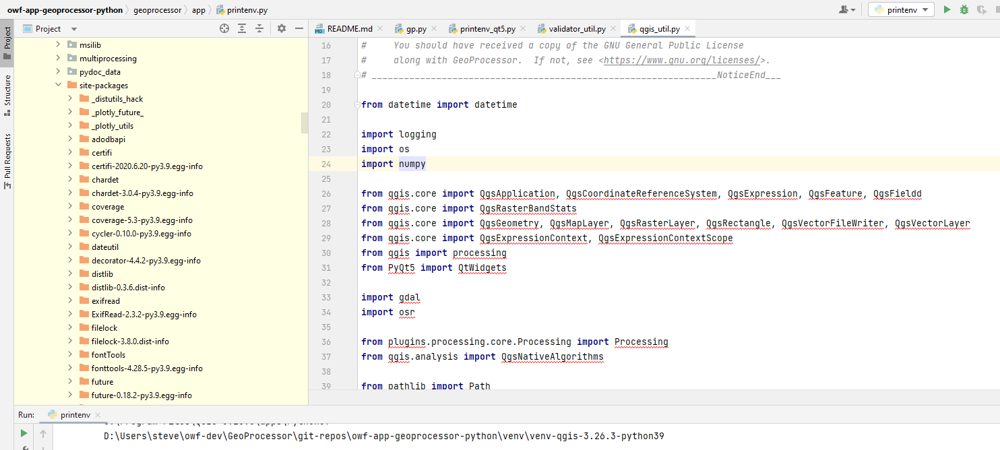
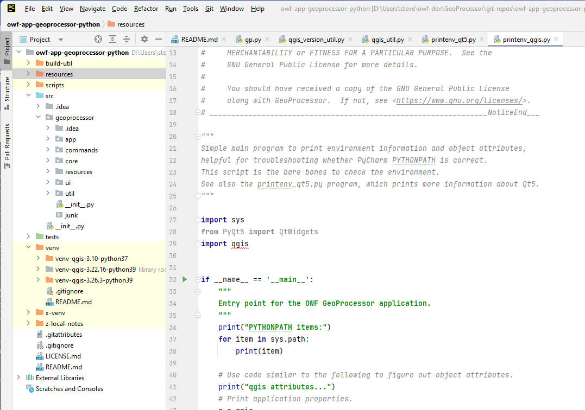

# GeoProcessor / Troubleshooting #

The GeoProcessor is a Python application that uses Python modules that are a part of the GeoProcessor,
and Python modules and software that are part of the QGIS (PyQGIS) and Qt (PyQt) software.
Consequently, errors can occur in various software components
and in various environment configurations from development environment to deployed software.
This page provides information about troubleshooting the GeoProcessor.

*   [Logging](#logging)
    +   [Log File](#log-file)
    +   [Command Status/Log](#command-statuslog)
*   [PyCharm Error Messages](#pycharm-error-messages)
    +   [Modules Not Found in PyCharm](#modules-not-found-in-pycharm)
*   [GeoProcessor Runtime Error Messages](#geoprocessor-runtime-error-messages)
*   [Python Runtime Error Messages](#python-runtime-error-messages)
    +   [Error Message: `ImportError: DLL load failed: The specified procedure could not be found.`](#error-message-importerror-dll-load-failed-the-specified-procedure-could-not-be-found)
    +   [Error Message: `Cannot mix incompatible Qt library (5.15.3) with this library (5.15.2)`.](#error-message-cannot-mix-incompatible-qt-library-5153-with-this-library-5152)

-------------

## Logging ##

The GeoProcessor uses the Python `logging` package to log messages to a log file.
Additionally, each command has a log that is used to display command-specific messages.
The following sections describe logging.

### Log File ###

The GeoProcessor uses the Python logging features to create a log file that is helpful to troubleshoot issues.
However, although log files may be helpful to software developers, they can be difficult for others to understand.
The log file exists in the following locations:

* User's home folder GeoProcessor files, for example as follows, where `1` is the GeoProcessor major version and `user` is the user:
    + Windows: `C:\Users\user\.owf-gp\1\logs\gp_user.log`
    + Linux:  `/home/user/.owf-gp/1/logs/gp_user.log`
    + Cygwin:  `/cygdrive/C/Users/user/.owf-gp/1/logs/gp_user.log` (different files from Windows)
    + Git Bash (MinGW):  `/c/Users/user/.owf-gp/1/logs/gp_user.log` (same files as Windows)
* File specified by the GeoProcessor [StartLog](http://software.openwaterfoundation.org/geoprocessor/latest/doc-user/command-ref/StartLog/StartLog/) command.

The log file contains a sequential record of log messages for application startup followed by
output from running the commands, as shown in the following example.
The first part of the line indicates the message type, which can be one of the following,
shown in increasing severity and therefore decreasing frequency:  `DEBUG`, `INFO`, `WARNING`, `ERROR`, and `CRITICAL`.
In other words, one should expect very few `CRITICAL` messages.  Any message of level `WARNING`, `ERROR`, or `CRITICAL`
should be dealt with because they can lead to a proliferation of problems in later commands.

```txt
INFO|geoprocessor|log line 151|Opened new log file: "C:\Users\sam\owf-dev\GeoProcessor\git-repos\owf-app-geoprocessor-python-test\test\commands\RemoveFile\results\test-RemoveFile.gp.log"
INFO|geoprocessor.core.GeoProcessor|GeoProcessor line 547|-> Start processing command 2 of 5: # Test removing a file
INFO|geoprocessor.core.GeoProcessor|GeoProcessor line 547|-> Start processing command 3 of 5: # Uncomment the following line to regenerate expected results
INFO|geoprocessor.core.GeoProcessor|GeoProcessor line 547|-> Start processing command 4 of 5: CopyFile(SourceFile="data/testfile.txt",DestinationFile="results/test-RemoveFile-out.txt")
INFO|geoprocessor.commands.util.CopyFile|CopyFile line 144|Copying file "C:\Users\sam\owf-dev\GeoProcessor\git-repos\owf-app-geoprocessor-python-test\test\commands\RemoveFile\data\testfile.txt" to "C:\Users\sam\owf-dev\GeoProcessor\git-repos\owf-app-geoprocessor-python-test\test\commands\RemoveFile\results\test-RemoveFile-out.txt"
INFO|geoprocessor.core.GeoProcessor|GeoProcessor line 547|-> Start processing command 5 of 5: RemoveFile(SourceFile="results/test-RemoveFile-out.txt")
INFO|geoprocessor.commands.util.RemoveFile|RemoveFile line 120|Removing file "C:\Users\sam\owf-dev\GeoProcessor\git-repos\owf-app-geoprocessor-python-test\test\commands\RemoveFile\results\test-RemoveFile-out.txt"
INFO|geoprocessor|gp line 188|GeoProcessor properties after running:
INFO|geoprocessor|gp line 190|UserName = sam
INFO|geoprocessor|gp line 190|ComputerName = colorado
INFO|geoprocessor|gp line 190|InstallDirURL = None
INFO|geoprocessor|gp line 190|OutputStart = None
INFO|geoprocessor|gp line 190|InitialWorkingDir = C:\Users\sam\owf-dev\GeoProcessor\git-repos\owf-app-geoprocessor-python-test\test\commands\RemoveFile
INFO|geoprocessor|gp line 190|WorkingDir = C:\Users\sam\owf-dev\GeoProcessor\git-repos\owf-app-geoprocessor-python-test\test\commands\RemoveFile
INFO|geoprocessor|gp line 190|InputStart = None
INFO|geoprocessor|gp line 190|OutputEnd = None
INFO|geoprocessor|gp line 190|UserHomeDir = C:\Users\sam
INFO|geoprocessor|gp line 190|ProgramVersionString = None
INFO|geoprocessor|gp line 190|TempDir = c:\users\sam\appdata\local\temp
INFO|geoprocessor|gp line 190|ComputerTimezone = Mountain Standard Time
INFO|geoprocessor|gp line 190|InputEnd = None
INFO|geoprocessor|gp line 190|InstallDir = None
INFO|geoprocessor|gp line 190|OutputYearType = None
INFO|geoprocessor|gp line 190|UserHomeDirURL = file:///C:/Users/sam
INFO|geoprocessor|gp line 190|ProgramVersionNumber = None
```

### Command Status/Log ###

The GeoProcessor UI displays command-specific warning messages,
which indicate problems that need to be resolved.
A command flagged with red X or yellow warning symbol can be reviewed to determine problems
by right-clicking on a command and using the ***Show Command Status*** menu or mousing over the error/warning icon.

The current log file can be viewed using the ***Tools / View Log File*** menu.
The startup log file can be viewed using the ***Tools / View Startup Log File*** menu.

## PyCharm Error Messages ##

The PyCharm interface shows error messages that are related to coding errors.
However, in some cases, the errors are more significant and are related to the development environment,
as discussed below.

### Modules Not Found in PyCharm ###

Modules may not be found in the PyCharm editor, resulting in red indicators.
This may be due to code being excluded from PyCharm indexing.

PyCharm has built-in features to index code modules so that they can be listed for code completion.
However, indexing many files that are found in the Python interpreter and `PYTHONPATH` requires a lot of computing resources.
Therefore, PyCharm excludes some code to improve performance.

For GeoProcessor development using QGIS 3.26.3,
it was found that QGIS-related packages and modules were not found in the editor,
although running the application did seem to find some of the files.
The files in question are listed in the `PYTHONPATH` in the
`build-util/run-pycharm-ce-for-qgis.bat` batch file used to run PyCharm,
using short file naming convention in order to avoid issues of spaces in the paths.
This has in the past allowed QGIS Python files to be used in the virtual environment created for PyCharm
without copying those files into the virtual environment.
The ***External Libraries*** in PyCharm shows the files to be excluded as source (see figure below) and there is
apparently no way to include them as source;
therefore, PyCharm does not index or use for code completion.

**<p style="text-align: center;">

</p>**

**<p style="text-align: center;">
PyCharm Missing Modules (<a href="../images/pycharm-missing-modules.png">see full-size image</a>)
</p>**

A process is used to create a deployed GeoProcessor virtual environment,
which similarly relies on QGIS Python files rather than coping into the virtual environment.

## GeoProcessor Runtime Error Messages ##

Error messages for GeoProcessor commands generally indicate how to fix issues,
such as correcting command parameters.
However, programming logic errors or other unforseen issues may result in
stack traces that are difficult to troubleshoot.
See the following section for Python errors.

## Python Runtime Error Messages ##

Python error messages typically consist of a "stack trace",
which shows the code files and line numbers for errors.
In some cases the deployed GeoProcessor code can be reviewed and edited and in other cases
compiled libraries and Python interpreter code is involved.
The following lists errors that have been encountered.

### Error Message: `ImportError: DLL load failed: The specified procedure could not be found.` ###

The following error may be shown and result in GeoProcessor not starting.
The cause has been shown to be a bad or incompatible DLL.
For example, manually copying DLLs so that `pip` can run and not have `SSL` issues caused this problem.
The solution is to remove the offending DLLs after they are used to overcome the `pip` `SSL` issue.

* See the [Development Environment / Python / Install Additional Python Packages / Troubleshooting](../dev-env/python.md#troubleshooting) documentation.

```
Traceback (most recent call last):
  File "C:\PROGRA~1\QGIS3~1.10\apps\Python37\lib\runpy.py", line 193, in _run_module_as_main
    "__main__", mod_spec)
  File "C:\PROGRA~1\QGIS3~1.10\apps\Python37\lib\runpy.py", line 85, in _run_code
    exec(code, run_globals)
  File "C:\Users\sam\gp-1.3.0.dev-win-qgis-3.10-venv\Lib\site-packages\geoprocessor\app\gp.py", line 39, in <module>
    from geoprocessor.commands.testing.StartRegressionTestResultsReport import StartRegressionTestResultsReport
  File "C:\Users\sam\gp-1.3.0.dev-win-qgis-3.10-venv\Lib\site-packages\geoprocessor\commands\testing\StartRegressionTestResultsReport.py", line 31, in <module>
    import geoprocessor.util.validator_util as validator_util
  File "C:\Users\sam\gp-1.3.0.dev-win-qgis-3.10-venv\Lib\site-packages\geoprocessor\util\validator_util.py", line 27, in <module>
    import ogr
  File "C:\Program Files\QGIS 3.10\apps\Python37\Lib\site-packages\ogr.py", line 2, in <module>
    from osgeo.gdal import deprecation_warn
  File "C:\Program Files\QGIS 3.10\apps\Python37\Lib\site-packages\osgeo\__init__.py", line 41, in <module>
    _gdal = swig_import_helper()
  File "C:\Program Files\QGIS 3.10\apps\Python37\Lib\site-packages\osgeo\__init__.py", line 24, in swig_import_helper
    _mod = imp.load_module('_gdal', fp, pathname, description)
  File "C:\PROGRA~1\QGIS3~1.10\apps\Python37\lib\imp.py", line 243, in load_module
    return load_dynamic(name, filename, file)
  File "C:\PROGRA~1\QGIS3~1.10\apps\Python37\lib\imp.py", line 343, in load_dynamic
    return _load(spec)
ImportError: DLL load failed: The specified procedure could not be found.
Exiting gp.bat with exit code 1
```

A similar issue is described in the Stack Overflow post for
["DLL load failed when importing PyQt5"](https://stackoverflow.com/questions/42863505/dll-load-failed-when-importing-pyqt5),
specifically for an error on the following code line.

```
from PyQt5 import QtCore
```

The solution to the above was to install the latest PyQt5.
For example, use PyCharm (***File / Settings / Pick Project / Python Interpreter***) to see the installed and available package versions
(QGIS 3.26.3 uses version 5.15.4 and 5.15.7 was available).
Then run the `OSGeo4W.bat` batch file in the QGIS installation folder as administrator and run the following.

```
python -m pip install PyQt5 --upgrade
```

If this does not work, it may be necessary to install another version as indicated in the above Stack Overflow post.

### Error Message: `Cannot mix incompatible Qt library (5.15.3) with this library (5.15.2)` ###

**Content from this section will be moved to environment setup when issues are figured out.**

This was found when debugging the code.
Was getting the `The specified procedure could not be found` error from above so ran:

```
gpuidev.bat /s3.22.16 /printenv /python
```

Then imported the `geoprocessor.app.gp` module and ran the main program code step by step.
So, where are the versions coming from?
If I use PyCharm ***File / Settings*** for the `owf-app-geoprocessor-python` project, the ***Python interpreter*** shows `PyQt5-Qt5` has  a version of 5.15.2 and other PyQt packages have different versions (none are 5.15.3).

If I run the QGIS OSGeo4W Shell as administrator (which is how Python packages had to be installed), list the installed Python packages with:

```
where python    (to confirm that the QGIS Python is being used)

pip list

PyQt5            5.15.9
PyQt5-Qt5        5.15.2
PyQt5-sip        12.11.1
```

Use File Explorer and navigate to `Program Files QGIS 3.22.16\apps\Qt5\bin`.  Right click on `Qt5Core.dll` and then use ***Properties***.  It shows version 5.15.3.0.

So it looks like PyQt5-Qt5 needs to be updated to 5.15.3.

Available libraries show PyQt5-Qt5 [5.15.2 is the latest available](https://pypi.org/project/PyQt5-Qt5/).

See this [Unhelpful post for context](https://gis.stackexchange.com/questions/431986/pyqgis-problems-update-to-3-24-3-with-qt-library-5-15-3).

Before doing anything else, uninstall the QGIS standalone 3.22.16 longterm release and reinstall to make sure that I have not cumulatively hacked anything in a bad way.

Figured out that PyCharm might be getting confused about what is code and automatically including folders in its internal `PYTHON_PATH`.
Restructured the project to have a `src` folder for code and move the top level `geoprocessor` folder to that.
Marked all but the src folder as code by right-clicking on folders and using the popup ***Mark Directory as / Excluded***.
See the [PyCharm "Configuring Project Structure"](https://www.jetbrains.com/help/pycharm/configuring-project-structure.html) documentation.
I think I may have tried to do this before but an earlier version of PyCharm perhaps did not allow such granular control?
Note that one of the virtal environments is marked as **not excluded** even though the `venv` folder is excluded.
PyCharm must be smart enough to always treat the current virtual environment as a active and scanned for modules for imports.

**<p style="text-align: center;">

</p>**

**<p style="text-align: center;">
PyCharm Project Files with Marked Folders(<a href="../images/pycharm-marked-folders.png">see full-size image</a>)
</p>**

It is also possible to open a PyCharm project by picking a different folder, for example only `src` or `src/geoprocessor`,
in which case if the files are assumed to be source files it would be OK to not mark any files.

After significantly cleaning up the PyCharm run script and `gpdev.bat`, am seeing the following:

```
Traceback (most recent call last):
  File "C:\PROGRA~1\QGIS32~1.16\apps\Python39\lib\runpy.py", line 197, in _run_module_as_main
    return _run_code(code, main_globals, None,
  File "C:\PROGRA~1\QGIS32~1.16\apps\Python39\lib\runpy.py", line 87, in _run_code
    exec(code, run_globals)
  File "D:\Users\steve\owf-dev\GeoProcessor\git-repos\owf-app-geoprocessor-python\src\geoprocessor\app\gp.py", line 32, in <module>
    from PyQt5 import QtCore
ImportError: DLL load failed while importing QtCore: The specified module could not be found.
```

## Pycharm PYTHONPATH is not what it seems ##

2022-03-06

It is clear after experimentation that even though the `C:\Program FIles\QGIS 3.22.16\apps\qgis-ltr\python` is in the `PYTHONPATH`
when running the program through PyCharm, the PyCharm editor does not find packages in that folder.
See [this Stack Overflow article](https://stackoverflow.com/questions/48947494/add-directory-to-python-path-in-pycharm),
which shows how to add to the PyCharm Python path.
Here is the corresponding [PyCharm documentation](https://www.jetbrains.com/help/pycharm/installing-uninstalling-and-reloading-interpreter-paths.html).
I added the above path and also `C:\Program Files\QGIS 2.22.16\apps\Python39\site-packages` and now the PyCharm
editor shows packages as being found.
Now I am working through packages that changed since 3.10.

## Create a venv again ##

From the above I reinstalled QGIS 3.22.16 stand-alone but did not rebuild a venv from that.
I renamed the `venv/venv-qgis-3.22.16-python39` folder to `venv/venv-qgis-3.22.16-pytyon-old`
(also had to edit its `Scripts/activate.bat` file to change the `VIRTUAL_ENV` variable).

Start PyCharm manually rather than the run script.

1.  ***File / Settings***
2.  For the `owf-app-geoprocessor-python` project,  click on ***Project Interpreter***
3.  ***Add Interpreter*** and then ***Add Local Interpreter...***
4.  ***Virtual Environment*** and ***New***.
5.  It seems to remember the old folders 
    Do not select inherit global site packages
    because will install the bare minimum packages in the virtual environment and rely on QGIS files as much as possible.
6.  PyCharm complains with ***Failed to Create Interpreter*** with [no useful details](pycharm-add-interpreter-error.png).
    This is probably because `virtualenv` package is not installed in the QGIS Python39 since I did a clean QGIS reinstall.
    Istall `virtualenv` and deal with the crypto/ssl DLLs to do it.
    The `pip` installer run in the QGIS shell worked without any changes to the SSL DLLs.
    However, the same error was displayed.
    The `C:/Users/xxx/AppData/Local/JetBrains/PyCharmCE2022.2/log/idea.log` file indicates an SSL issue so try
    copying the SSL DLLs as per [troubleshooting documentation](../dev-env/python.md#troubleshooting-installing-additional-python-packages).
    That was it.  It sure would be nice if PyCharm provide more useful error messages.
7.  Edit the name of the new venv to be more appropriate rather than having `(2)` in the name.
    Call it `Python 3.9 (owf-app-geoprocessor-python) (QGIS 3.22.16 Python39)`.
8.  Check what packages are installed and it only lists `pip`, `setuptools`, and `wheel`.
    Therefore, install the additional packages as per [this documentation](../dev-env/python.md#development-environment-virtual-environment-additional-packages).
    Note that `where python` shows python installed in `C:\Users\xxx\AppData\Local\Microsoft\WindowsApps\python.exe`.
    Therefore, make sure to run from the `venv` `Scripts` folder with `.\python.exe...`.
    After installing the packages look like .
9.  The PyCharm interface shows errors importing from `qgis` and `PyQt5` packages, as expected from previous experience.
    Although the `PYTHONPATH` is set to reasonable values before running PyCharm from the run script,
    PyCharm itself does not seem to recognize it.
    The list of paths [before adding paths](images/pycharm-interpreter-before-adding-paths.png) contians only the main QGIS Python39 folders
    and the `venv` `site-packages`, the latter of which reflect the additional packages that were installed.
    It would be nice to add this to a PyCharm configuration file but have not been able to figure out where the information is stored.
    I created a folder `dummyfolder` and added it to the interpreter paths.
    Searching the project files showed nothing but searching the user `AppData/Local/JetBrains` folder found `dummyfolder` in
    several binary files.  It does not look like there is an easy way to automate passing on the interpreter paths so add interactively.
    Add the following consistent with what the run scripts are adding to `PYTHONPATH` in the run scripts.
    *   `C:\Program Files\QGIS 3.22.16\apps\qgis-ltr\python` (fixes `import qgis...` in `geoprocessor.util.qgis_util`)
    *   `C:\Program Files\QGIS 3.22.16\apps\qgis-ltr\python\plugins`
    *   `C:\Program Files\QGIS 3.22.16\apps\Python39\Lib\site-packages` (fixes `from PyQt5 import ...`)

The imports are as follows:

```
From the run scripts.

Project source         U  D:\Users\steve\owf-dev\GeoProcessor\git-repos\owf-app-geoprocessor-python\src

Interpreter Paths

PyCharm                P  C:\PROGRA~1\QGIS32~1.16\apps\Python39\DLLs
PyCharm (uses Lib)     P  C:\PROGRA~1\QGIS32~1.16\apps\Python39\lib
PyCharm                U  C:\PROGRA~1\QGIS32~1.16\apps\Python39
PyCharm                   D:\Users\steve\owf-dev\GeoProcessor\git-repos\owf-app-geoprocessor-python\venv\venv-qgis-3.22.16-python39
PyCharm                U  D:\Users\steve\owf-dev\GeoProcessor\git-repos\owf-app-geoprocessor-python\venv\venv-qgis-3.22.16-python39\Lib\site-packages

User                   U  C:\PROGRA~1\QGIS32~1.16\apps\qgis-ltr\python
User                   U  C:\PROGRA~1\QGIS32~1.16\apps\qgis-ltr\python\plugins
                       P  D:\Users\steve\owf-dev\GeoProcessor\git-repos\owf-app-geoprocessor-python\scripts
User                   U  C:\PROGRA~1\QGIS32~1.16\bin
User                   U  C:\PROGRA~1\QGIS32~1.16\apps\Python39\Lib\site-packages
User (for processing)  U  C:\PROGRA~1\QGIS32~1.16\apps\Python39\Scripts
NA - does not exist    P  C:\PROGRA~1\QGIS32~1.16\apps\Python39\python39.zip
User (for what?)       P  C:\PROGRA~1\QGIS32~1.16\apps\Python39\lib\site-packages\win32
User (for what?)       P  C:\PROGRA~1\QGIS32~1.16\apps\Python39\lib\site-packages\win32\lib
User (for what?)       P  C:\PROGRA~2\QGIS32~1.16\apps\Python39\lib\site-packages\Pythonwin
```

## Start Over ##

This is painful.

I found in the QGIS bin folder a batch file `python-qgis-ltr.bat`.
I modified this to launch the GeoProcessor and it worked!
I'm going to commit everything as it is and revisit the launch scripts, simplifying a lot.

I updated the `gpdev.bat` file based on the above and it works.
One key point is that it works when running the `bin\python.exe` but when running
`apps\Python39\python.exe` it fails with the familiar:

```
Traceback (most recent call last):
  File "C:\PROGRA~1\QGIS32~1.16\apps\Python39\lib\runpy.py", line 197, in _run_module_as_main
    return _run_code(code, main_globals, None,
  File "C:\PROGRA~1\QGIS32~1.16\apps\Python39\lib\runpy.py", line 87, in _run_code
    exec(code, run_globals)
  File "D:\Users\steve\owf-dev\GeoProcessor\git-repos\owf-app-geoprocessor-python\src\geoprocessor\app\gp.py", line 32, in <module>
    from PyQt5 import QtCore
ImportError: DLL load failed while importing QtCore: The specified module could not be found.
```

This is problematic (I think) because to launch PyCharm need to use the `venv`,
which is going to use a typical Python setup, not a one-off executable.
If can't use PyCharm, it is difficult to edit and troubleshoot the code.

The `python.exe` in both folders is the same file.
Python automatically adds some paths to the `sys.path`, based on `PYTHONPATH` and the start folder.

Both the successful and failed runs prints the following:

```
    Python Path (sys.path), sorted, useful to compare search path locations:
        C:\PROGRA~1\QGIS32~1.16\apps\Python39
        C:\PROGRA~1\QGIS32~1.16\apps\Python39\DLLs
        C:\PROGRA~1\QGIS32~1.16\apps\Python39\lib
        C:\PROGRA~1\QGIS32~1.16\apps\Python39\lib\site-packages
        C:\PROGRA~1\QGIS32~1.16\apps\Python39\lib\site-packages\Pythonwin
        C:\PROGRA~1\QGIS32~1.16\apps\Python39\lib\site-packages\win32
        C:\PROGRA~1\QGIS32~1.16\apps\Python39\lib\site-packages\win32\lib
        C:\PROGRA~1\QGIS32~1.16\apps\qgis-ltr\python
        C:\PROGRA~1\QGIS32~1.16\apps\qgis-ltr\python\plugins
        C:\PROGRA~1\QGIS32~1.16\bin
        C:\PROGRA~1\QGIS32~1.16\bin\python39.zip
        D:\Users\steve\owf-dev\GeoProcessor\git-repos\owf-app-geoprocessor-python\scripts
        D:\Users\steve\owf-dev\GeoProcessor\git-repos\owf-app-geoprocessor-python\scripts
        D:\Users\steve\owf-dev\GeoProcessor\git-repos\owf-app-geoprocessor-python\src
        D:\Users\steve\owf-dev\GeoProcessor\git-repos\owf-app-geoprocessor-python\venv\venv-qgis-3.22.16-python39\Lib\site-packages
```

The `PATH` environment variable has the following in both cases:

```
PATH Environment Variable, sorted:
        C:\PROGRA~1\QGIS32~1.16\apps\qgis-ltr\bin
        C:\PROGRA~1\QGIS32~1.16\apps\qt5\bin
        C:\PROGRA~1\QGIS32~1.16\apps\Python39\Scripts
        C:\PROGRA~1\QGIS32~1.16\bin
        C:\WINDOWS\system32
        C:\WINDOWS
        C:\WINDOWS\system32\WBem
```

Note that the `apps\Python39\DLLs` folder is not included.
The QGIS `bin` folder has many `dll` files that may be automatically searched,
but maybe something subtle is going on.

I added the `apps\Python39\DLLs` folder to the front of the `PATH` and it still fails.
The only change I made to QGIS was to `pip` install `virtualenv` and copy the SSL `dll` files into the
`apps\Python39\DLLs` folder so that `pip` would work.
Try removing the `libcrypto-1_1-x64.dll` and `libssl-1_1-x64.dll` files.
This gives the same results.  Are `dll` files cached in memory to improve performance?
I don't have Visual Studio installed so don't have `gacutil` but searching `Windows\Microsoft.NET\assembly` files for `crypto`
does not list the QGIS DLLs.

Using the Python39 executable,
I ran the Python interpreter from the script with `/python` instead of launching the application and
then ran the line `from PyQt5 import QtCore`.
The bad output shows the following immediately after launching the interpreter:

```

The filename, directory name, or volume label syntax is incorrect.
The filename, directory name, or volume label syntax is incorrect.

Traceback (most recent call last):
  File "<stdin>", line 1, in <module>
  File "<frozen importlib._bootstrap>", line 1058, in _handle_fromlist
  File "<frozen importlib._bootstrap>", line 228, in _call_with_frames_removed
  File "<frozen importlib._bootstrap>", line 1007, in _find_and_load
  File "<frozen importlib._bootstrap>", line 986, in _find_and_load_unlocked
  File "<frozen importlib._bootstrap>", line 666, in _load_unlocked
  File "<frozen importlib._bootstrap>", line 565, in module_from_spec
  File "<frozen importlib._bootstrap_external>", line 1173, in create_module
  File "<frozen importlib._bootstrap>", line 228, in _call_with_frames_removed
ImportError: DLL load failed while importing QtCore: The specified module could not be found.
```

The successful import has:

```
# extension module 'PyQt5.sip' loaded from 'C:\\PROGRA~1\\QGIS32~1.16\\apps\\Python39\\lib\\site-packages\\PyQt5\\sip.cp39-win_amd64.pyd'
# extension module 'PyQt5.sip' executed from 'C:\\PROGRA~1\\QGIS32~1.16\\apps\\Python39\\lib\\site-packages\\PyQt5\\sip.cp39-win_amd64.pyd'
import 'PyQt5.sip' # <_frozen_importlib_external.ExtensionFileLoader object at 0x000001F6700F5780>
# extension module 'PyQt5.QtCore' loaded from 'C:\\PROGRA~1\\QGIS32~1.16\\apps\\Python39\\lib\\site-packages\\PyQt5\\QtCore.pyd'
# extension module 'PyQt5.QtCore' executed from 'C:\\PROGRA~1\\QGIS32~1.16\\apps\\Python39\\lib\\site-packages\\PyQt5\\QtCore.pyd'
import 'PyQt5.QtCore' # <_frozen_importlib_external.ExtensionFileLoader object at 0x000001F6700EFC80>
```

I made a copy of the original `bin\python-qgis-ltr.bat` file called `bin\python-qgis-ltr-Python39.bat` and changed the last
line as follows:

```
@echo off
call "%~dp0\o4w_env.bat"
@echo off
path %OSGEO4W_ROOT%\apps\qgis-ltr\bin;%PATH%
set QGIS_PREFIX_PATH=%OSGEO4W_ROOT:\=/%/apps/qgis-ltr
set GDAL_FILENAME_IS_UTF8=YES
rem Set VSI cache to be used as buffer, see #6448
set VSI_CACHE=TRUE
set VSI_CACHE_SIZE=1000000
set QT_PLUGIN_PATH=%OSGEO4W_ROOT%\apps\qgis-ltr\qtplugins;%OSGEO4W_ROOT%\apps\qt5\plugins
set PYTHONPATH=%OSGEO4W_ROOT%\apps\qgis-ltr\python;%PYTHONPATH%
rem python %*
%OSGEO4W_ROOT%\apps\Python39\python
```

Running this and trying to do `from PyQt5 import QtCore` gives the error above.
This seems like a question for QGIS people.
I posted a [Stack Overflow question](https://stackoverflow.com/questions/75677615/qgis-3-22-16-bin-python-qgis-ltr-bat-will-not-run-apps-python39-python).

### Pandas Incompatibility ###

After getting over the initial hump to use QGIS 3.22.16 to develop the GeoProcessor,
the automated tests were run.  There were many failures.
The `ReadTbleFromExcel` tests fail with the following:

```
ImportError: Pandas requires version '2.0.1' or newer of 'xlrd' (version '1.2.0' currently installed).
```

I think what is going on is that a recent version of the `pandas` package (1.5.3) is installed in the `venv` to support GeoProcessor.
However, QGIS also now installs `pandas` (opened the OSGeo4W shell and ran `pip list`) but is version `1.1.3`.
Therefore, `pandas` no longer needs to be installed as an additional package with GeoProcessor.

Remove `pandas` from the `venv` by running the following in a Windows command shell,
and in the future don't need to install as an additional package with the GeoProcessor `venv`.

```
cd venv\venv-qgis-3.22.16-python39\Scripts
activate
where pip                     (shows using the venv pip)
pip list                      (shows pandas 1.5.3)
pip uninstall pandas
pip uninstall numpy           (noticed this is also distributed with QGIS now, maybe is packaged with pandas in the `venv`?)
```

The ReadTableFromExcel command now runs without an error.
