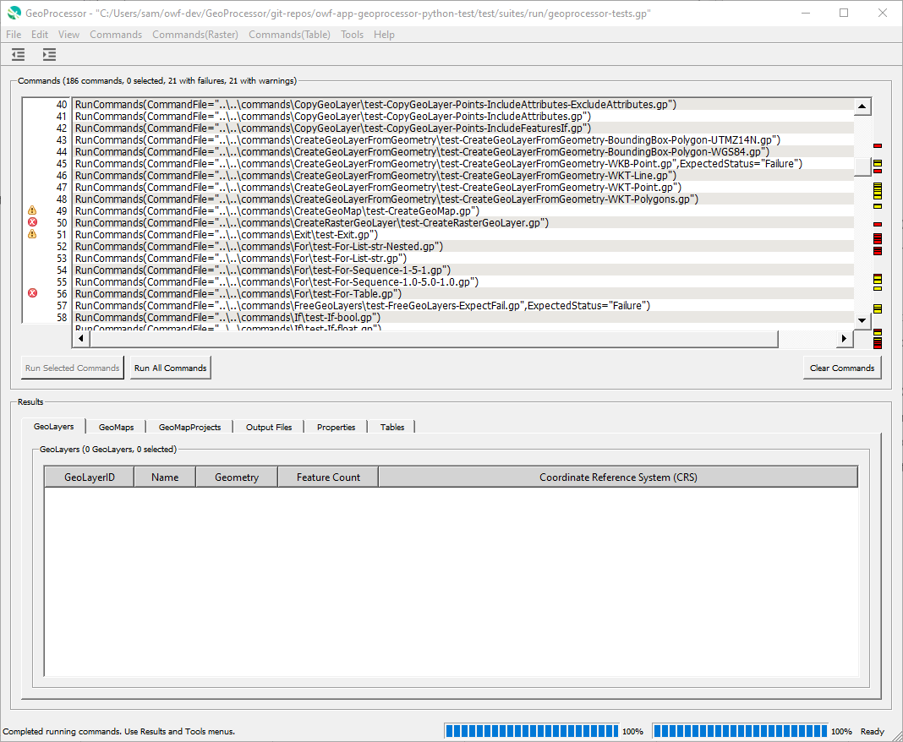

# GeoProcessor / User Interface (UI) Design #

* [Overview](#overview)
	+ [Using the UI](#using-the-ui)
	+ [UI Design Overview](#ui-design-overview)
	+ [User Interface Terms](#user-interface-terms)
	+ [Package Structure](#package-structure)
* [Main UI](#main-ui):
	+ The [`GeoProcessorUI` Class](#geoprocessorui-class) - the main UI class
	+ The [`CommandListWidget` Class](#commandlistwidget-class) - widget class to display and manage commands
	+ The [`GeoProcessorCommandEditorFactory` Class](#geoprocessorcommandeditorfactory-class) - create command editors
* [Command Editor UI](#command-editor-ui):
	+ The [`AbstractCommandEditor` Class](#abstractcommandeditor-class) - parent class for all command editors
	+ The [`GenericCommandEditor` Class](#genericcommandeditor-class) - default command editor
	+ The [`InsertLineEditor` Class](#insertlineeditor-class) - editor for one-line commands without parameters
	+ The [`InsertLineRulerEditor` Class](#insertlinerulereditor-class) - editor for multi-line commands without parameters
	+ The [`SimpleCommandEditor` Class](#simplecommandeditor-class) - simple one panel editor
	+ The [`TabbedCommandEditor` Class](#tabbedcommandeditor-class) - tabbed panel editor
	+ [Command Input Metadata](#command-input-metadata) - configuring command editors
* Utility Modules:
	+ to be added
* [Resources](#resources)

------------------

## Overview

This documentation explains the user interface design. 

### Using the UI ###

A basic summary of using the UI is as follows:

1. Start the GeoProcessor user interface using an instance of `GeoProcessorUI` class,
instantiated from the `gp.py` module.
2. Use the ***File / Open Command File*** menu to open a command file.
3. The command file will appear in the ***Command List***, implemented using the `CommandListWidget` class. 
Each line of the command file is a unique line in the `command list` ui component
4. Click the ***Run Commands*** button. 
The GeoProcessor instance used by the UI will run the commands.
5. Right click on a command in the command list and select ***Edit Command*** to edit a command.

### UI Design Overview ###

The user interface is implemented by the following classes and modules, listed in order of general to specific,
with sections below to provide more details.

1. Main UI:
	1. The [`GeoProcessorUI` class](#geoprocessorui-class)
		* creates the main window user interface
		* controls the actions that take place on the main window
	2. The [`CommandListWidget` class](#commandlistwidget-class)
		* is the visual component of MVC pattern that displays the list of commands
		* has an instance of `GeoProcessorListModel`, which is the model part of MVC pattern and has an instance of `GeoProcessor`
	3. The [`GeoProcessorCommandEditorFactory` class](#geoprocessorcommandeditorfactory-class)
		* determines which instance of command editor to create from command
2. Command Editor:
	1. The [`AbstractCommandEditor` class](#the-abstractcommandeditor-class)
		* parent class to all command editor classes 
		* creates the features of the `command dialog` windows that are consistent across all `command dialog` windows 
		* controls the actions that take place consistently across all `command dialog` windows 
	2. The [`GenericCommandEditor` class](#genericcommandeditor-class) - used for unknown commands
	3. The [`SimpleCommandEditor` class](#simplecommandeditor-class) - used for most commands
	4. The [`TabbedCommandEditor` class](#tabbedcommandeditor-class) - used for advanced commands with many parameters
3. UI utility classes:
	1. The [`qt_util`](#qt_util) module provides useful functions for Qt

### User Interface Terms ###

The following terms are used to describe the user interface.
See images after the table.

|Term|Definition|
|-|-|
|Main Window|The GeoProcessor's main application window. All functionality within the GeoProcessor user interface can be accessed via this window. The `main` window is the first window to appear when the GeoProcessor is started in *ui* mode.|
|Command Editor Window|The user interface window that allows the user to create a new command or edit an existing command. There is one `command editor` window for each GeoProcessor command. The command editor window has input fields used to enter the values for the command parameters.|
|Command List UI Component|A subset of the GeoProcessor main window that holds the commands of the command file. There is one line within the `command list` ui component for each command in the command file.|

**<p style="text-align: center;">

</p>**

**<p style="text-align: center;">
Main Window (<a href="../images/main-window.png">see full-size image</a>)
</p>**

**<p style="text-align: center;">

</p>**

**<p style="text-align: center;">
Command Editor Window (<a href="../images/command-editor-window.png">see full-size image</a>)
</p>**

**<p style="text-align: center;">

</p>**

**<p style="text-align: center;">
Command List UI Component(<a href="../images/command-list-ui-component.png">see full-size image</a>)
</p>**

### Package Structure ###

The following illustrates the organization of UI-related classes and modules.

```
geoprocessor/
  ui/                                      Contains all files relating to the UI. 
    app/                                   Contains all files relating to the UI main window.
      CommandListWidget.py                 Widget to display and interact with the command list.
      GeoProcessorUI.py                    The main UI.
      GeoProcessorUI_Design.py             Used to prototype initial UI components using the UI Designer software,
                                           not used in the application.
    commands/                              Contains all files relating to the GeoProcessor command editors.
      abstract/                            Contains all files relating to the abstract (general) command editors.
        AbstractCommandEditor.py           Parent class for all command editors.
        GenericCommandEditor.py            Default command editor for unknown commands.
        SimpleCommandEditor.py             Command editor that uses vertical parameter list.
        TabbedCommandEditor.py             Command editor that uses tabbed layout.
      commands/                            Specific command editors, when above general editors do not suffice.
        .../                               To be determined.
        util/                              Utility command editors.
          InsertLineEditor.py              Simple single-line editor, such as for comment block start and stop commands.
          InsertLineRulerEditor.py         Editory for multi-line comments.
    core/                                  Core UI components.
      GeoProcessorCommandEditorFactory.py  Creates a command editor for a command.
      GeoProcessorListModel.py             A Qt QAbstractListModel to manage the list of commands.
      GeoProcessorListView.py              A Qt QListView to view the list of commands.
    util/
      CommandListBackup.py                 Class to manage a backup of the command list to detect changes.
      CommandParameter.py                  Class to hold command parameter information for editors.
      qt_util.py                           Qt utility functions.
   
```

## Main UI ##

The main UI is implemented in the `GeoProcessorUI`, which is discussed in the next section.
An instance of this class is created by the main `gp.py` application if run with `--ui` command parameter.

### `GeoProcessorUI` Class ###

The [`geoprocessor.ui.app.GeoProcesssorUI`](https://github.com/OpenWaterFoundation/owf-app-geoprocessor-python/blob/master/geoprocessor/ui/app/GeoProcessorUI.py)
class is the main application UI class, which uses Qt5 to implement the user interface.
The class is a child of the `QMainWindow` class.
The class defines many components for menus, toolbar, and components for commands and results.
The main data objects are as follows:

| **GeoProcessorUI Data Object** | **Description** |
| -- | -- |
| `app_session` | Instance of the [`GeoProcessorAppSession`](https://github.com/OpenWaterFoundation/owf-app-geoprocessor-python/blob/master/geoprocessor/app/GeoProcessorAppSession.py) class, which maintains list of application data for the user. |
| `geoprocessor` | Instance of [`GeoProcessor`](https://github.com/OpenWaterFoundation/owf-app-geoprocessor-python/blob/master/geoprocessor/core/GeoProcessor.py), which is used to run the commands and provide results for the UI. |
| `gp_model` | Instance of [`GeoProcessorListModel`](https://github.com/OpenWaterFoundation/owf-app-geoprocessor-python/blob/master/geoprocessor/ui/core/GeoProcessorListModel.py), which manages a list of commands for the UI. |
| `commmands_cut_buffer` | List of commands from cut/copy actions, which can be pasted into the command list. |

Important `GeoProcessorUI` functions are as follows.
It can be difficult to keep track of UI functions in Python and consequently changes and cleanup may occur over time.
An effort is made to avoid stray functions that are not called.

| **Function** | **Description** |
| -- | -- |
| `closeEvent*` | Called when closing the UI, prompts to save command file. |
| `command_started`, `command_completed` | Called because `GeoProcessor.add_command_processor_listener()` was called to listen to process status. |
| `copy_commands_to_clipboard`, `cut_commands_to_clipboard`, `paste_commands_from_clipboard` |  Implement cut/copy/paste functionality. |
| `deselect_all_commands`, `select_all_commands` | Response to deselect and select all commands menu. |
| `edit_existing_command` | Edit an existing command, called when double-click on commmand or right-click ***Edit*** menu is selected. |
| `edit_new_command` | Edit a new command, called when command is inserted from the ***Commands*** menu. |
| `setup_ui*` | Set up various components for the UI. |
| `show_command_status*` | Display `CommandStatus` data. |
| `show_results*` | Update ***Results*** area contents. |
| `ui_action*` | Respond to user actions initiated through menus and buttons. |
| `ui_init*` | Initialize the user interface. |
| `ui_set_main_window_title` | Set the title of the main window to indicate command file name and status. |
| `update_ui_status*` | Update UI status information such as labels listing number of items, how many selected, etc. |

### `CommandListWidget` Class ###

The top part of the `GeoProcessorUI` class that displays the list of commands uses the custom
[`CommandListWidget`](https://github.com/OpenWaterFoundation/owf-app-geoprocessor-python/blob/master/geoprocessor/ui/app/CommandListWidget.py) class.
This widget is an integration of the following components:

| **Component**&nbsp;&nbsp;&nbsp;&nbsp;&nbsp;&nbsp;&nbsp;&nbsp;&nbsp;&nbsp;&nbsp;&nbsp;&nbsp;&nbsp;&nbsp;&nbsp; | **Type**&nbsp;&nbsp;&nbsp;&nbsp;&nbsp;&nbsp;&nbsp;&nbsp;&nbsp;&nbsp;&nbsp;&nbsp;&nbsp;&nbsp;&nbsp;&nbsp;&nbsp;&nbsp;&nbsp;&nbsp;&nbsp;&nbsp;&nbsp;&nbsp;&nbsp;&nbsp;&nbsp;&nbsp;&nbsp;&nbsp;&nbsp;&nbsp;&nbsp;&nbsp; | **Description** |
| -- | -- | -- |
| `command_ListView` | [`GeoProcessorListView`](https://github.com/OpenWaterFoundation/owf-app-geoprocessor-python/blob/master/geoprocessor/ui/core/GeoProcessorListView.py) | List view that extends [`QListView`](https://doc.qt.io/qtforpython/PySide2/QtWidgets/QListView.html), which allows using the [`GeoProcessorListModel`](https://github.com/OpenWaterFoundation/owf-app-geoprocessor-python/blob/master/geoprocessor/ui/core/GeoProcessorListModel.py), which interfaces with the `GeoProcessor` instance.  An earlier design used a `QListWidget`, but this required translating commands to strings in the list, which added additional synchronization and was confusing.  A limitation of `QListView` is that it does not seem to provide as many methods as `QListWidget`. |
| `number_ListWidget` | [`QListWidget`](https://doc.qt.io/qtforpython/PySide2/QtWidgets/QListWidget.html) | List of command numbers and icon to indicate command status, similar to Eclipse and PyCharm.  The list is synchronized the `command_ListView` after running commands. |
| `gutter_ListWidget` | [`QListWidget`](https://doc.qt.io/qtforpython/PySide2/QtWidgets/QListWidget.html) | Narrow gutter that indicates command status with a colored block, similar to Eclipse and PyCharm.  The list is synchronized with `command_ListView` after running commands. |

Using the above design helps ensure that the user interface interactions with commands uses the list of commands in the `GeoProcessor`.

### `GeoProcessorCommandEditorFactory` Class ###

The [`GeoProcessorCommandEditorFactory`](https://github.com/OpenWaterFoundation/owf-app-geoprocessor-python/blob/master/geoprocessor/ui/core/GeoProcessorCommandEditorFactory.py) class
creates an instance of a command editor for a command.
This is similar to how commands are created with `GeoProcessorCommandFactory`.
However, whereas each command's computational functionality is implemented in a separate command,
command editors share common code to limit the amount of coding that needs to be done.

The commands `command_metadata['EditorType']` value is checked, and depending on value,
a corresponding editor is instantiated to edit the command.
Editing occurs on the string properties that correspond to the parameters in the command's `(....)` string.

The following table lists the editor types that are handled by the factory, which are discussed more in following sections.
See also the [`AbstractCommandEditor`](#abstractcommandeditor-class),
which is the parent class for all editors and provides useful utility functions.

| **`EditorType`**&nbsp;&nbsp;&nbsp;&nbsp;&nbsp;&nbsp;&nbsp;&nbsp;&nbsp;&nbsp;&nbsp;&nbsp;&nbsp;&nbsp;&nbsp;&nbsp;&nbsp;&nbsp;&nbsp;&nbsp;&nbsp;&nbsp;&nbsp;&nbsp;&nbsp;&nbsp;&nbsp;&nbsp;&nbsp;&nbsp;&nbsp;&nbsp;&nbsp;&nbsp;&nbsp;&nbsp;&nbsp;&nbsp;&nbsp;&nbsp;&nbsp;&nbsp;&nbsp;&nbsp;&nbsp;&nbsp; | **Class**&nbsp;&nbsp;&nbsp;&nbsp;&nbsp;&nbsp;&nbsp;&nbsp;&nbsp;&nbsp;&nbsp;&nbsp;&nbsp;&nbsp;&nbsp;&nbsp;&nbsp;&nbsp;&nbsp;&nbsp;&nbsp;&nbsp;&nbsp;&nbsp;&nbsp;&nbsp;&nbsp;&nbsp;&nbsp;&nbsp;&nbsp;&nbsp;&nbsp; | **Description** |
| -- | -- | -- |
| `Generic` | [`GenericCommandEditor`](#genericcommandeditor-class) | Used for unknown commands - provides simple command area display. | 
| `InsertLineEditor` | [`InsertLineEditor`](#insertlineeditor-class) | Used for single-line commands without parameters, such as `/*` and `*/` - provides simple non-editable command area. | 
| `InsertLineRulerEditor` | [`InsertLineRulerEditor`](#insertlinerulereditor-class) | Used for multi-line commands without parameters, currently only `#` - provides ruler and simple editable command area. | 
| `Simple` | [`SimpleCommandEditor`](#simplecommandeditor-class) | Used for most commands - provides vertical list of parameter label, editable value, and description. | 
| `Table` | [`TabbedCommandEditor`](#tabbedcommandeditor-class) | **Not yet implemented** - provides tabbed editor to group parameters, each with vertical list of parameter label, editable value, and description. | 

## Command Editor UI ##

Command editors are implemented as classes that extend Qt [`QDialog`](https://doc.qt.io/qtforpython/PySide2/QtWidgets/QDialog.html).
Command editors are modal, meaning that the editor takes over the application and must be closed before accessing the main UI again.
To minimize coding, dialogs are implemented using a standard design controlled by the
`AbstractCommand`'s `command_metadata` and `command_parameter_metadata` data, which are defined in each child command's class.
Child classes such as `SimpleCommandEditor` can rely on helper functions in the `AbstractCommandEditor` to insert UI components
for single value, choices, file selectors, etc.

In some cases, such as `InsertLineEditor` and `InsertLineRulerEditor` (and likely other commands in the future),
custom UI features must be implemented and the utility functions in `AbstractCommandEditor` are not used as extensively.

Each specific editor should call code similar to the following, using `SimpleCommandEditor` as an example:

```
    def __init__(self, command: AbstractCommand, app_session: GeoProcessorAppSession) -> None:

        # The following will initialize shared components in AbstractCommandEditor
        super().__init__(command)

        # ...other code here...

        # Setup the UI in the AbstractCommandEditor class, which will call back to setup_ui() in this class.
        # - the AbstractCommandEditor populates some UI components such as the buttons at the bottom
        self.setup_ui_core()
```

The `AbstractCommandEditor.setup_ui_core()` function will then call a number of other functions
to set up editor dialog components.
These functions can be overloaded in child classes if necessary.
Reviewing the code for different editor types illustrates how editors are implemented.

### `AbstractCommandEditor` Class ###

The [`AbstractCommandEditor`](https://github.com/OpenWaterFoundation/owf-app-geoprocessor-python/blob/master/geoprocessor/ui/commands/abstract/AbstractCommandEditor.py)
class is the parent class to all GeoProcessor command editors.
The following setup functions are called in sequence to set up the main components (areas) of the editor:

| **Function**&nbsp;&nbsp;&nbsp;&nbsp;&nbsp;&nbsp;&nbsp;&nbsp;&nbsp;&nbsp;&nbsp;&nbsp;&nbsp;&nbsp;&nbsp;&nbsp;&nbsp;&nbsp;&nbsp;&nbsp;&nbsp;&nbsp;&nbsp;&nbsp;&nbsp;&nbsp;&nbsp;&nbsp;&nbsp;&nbsp;&nbsp;&nbsp;&nbsp;&nbsp;&nbsp;&nbsp;&nbsp;&nbsp;&nbsp;&nbsp;&nbsp;&nbsp;&nbsp;&nbsp;&nbsp;&nbsp;&nbsp;&nbsp;&nbsp;&nbsp;&nbsp;&nbsp;&nbsp;&nbsp;&nbsp;&nbsp;&nbsp;&nbsp;&nbsp;&nbsp; | **Description** | **Calls**&nbsp;&nbsp;&nbsp;&nbsp;&nbsp;&nbsp;&nbsp;&nbsp;&nbsp;&nbsp;&nbsp;&nbsp;&nbsp;&nbsp;&nbsp;&nbsp;&nbsp;&nbsp;&nbsp;&nbsp;&nbsp;&nbsp;&nbsp;&nbsp;&nbsp;&nbsp;&nbsp;&nbsp;&nbsp;&nbsp;&nbsp;&nbsp;&nbsp;&nbsp;&nbsp;&nbsp;&nbsp;&nbsp;&nbsp;&nbsp;&nbsp;&nbsp;&nbsp;&nbsp;&nbsp;&nbsp;&nbsp;&nbsp;&nbsp;&nbsp;&nbsp;&nbsp;&nbsp;&nbsp; |
| -- | -- | -- |
| `setup_ui_core` | Sets up all core components of any editor dialog. | `setup_ui_core_top`, `setup_ui`, `setup_ui_core_bottom`, `setup_ui_2` | 
| &nbsp;&nbsp;&nbsp;`setup_ui_core_top` | Sets up the top components:  dialog title and icon, description, and documentation button. | `setup_ui_core_command_description` |
| &nbsp;&nbsp;&nbsp;&nbsp;&nbsp;&nbsp;`setup_ui_core_command_description` | Sets up the command description from command `command_metadata['Description']` data. | |
| &nbsp;&nbsp;&nbsp;`setup_ui` | Sets up the main part of the UI - should be implemented in each editor type. For example, `SimpleCommandEditor` creates a vertical list of components to edit command parameters. | |
| &nbsp;&nbsp;&nbsp;`setup_ui_core_bottom` | Sets up the bottom part of the UI:  command string display area and dialog buttons. | `setup_ui_core_command_area`, `setup_ui_core_command_buttons` |
| &nbsp;&nbsp;&nbsp;&nbsp;&nbsp;&nbsp;`setup_ui_core_command_area` | Sets up the read-only area to display the full command string.  This function is overloaded in `InsertLineRulerEditor`. | |
| &nbsp;&nbsp;&nbsp;&nbsp;&nbsp;&nbsp;`setup_ui_core_command_buttons` | Sets up the standard editor buttons ***OK*** and ***Cancel***. | |
| &nbsp;&nbsp;&nbsp;`setup_ui_2` | Final editor setup - should be implemented in each editor type, as needed. For example, `SimpleCommandEditor` sets the focus on the first parameter component so the user does not need to reposition the mouse. | |

The following utility functions can be called to configure command editor components for parameters,
which are used by the `SimpleEditor` and `TabbedEditor`:

| **Function**&nbsp;&nbsp;&nbsp;&nbsp;&nbsp;&nbsp;&nbsp;&nbsp;&nbsp;&nbsp;&nbsp;&nbsp;&nbsp;&nbsp;&nbsp;&nbsp;&nbsp;&nbsp;&nbsp;&nbsp;&nbsp;&nbsp;&nbsp;&nbsp;&nbsp;&nbsp;&nbsp;&nbsp;&nbsp;&nbsp;&nbsp;&nbsp;&nbsp;&nbsp;&nbsp;&nbsp;&nbsp;&nbsp;&nbsp;&nbsp;&nbsp;&nbsp;&nbsp;&nbsp;&nbsp;&nbsp;&nbsp;&nbsp;&nbsp;&nbsp;&nbsp;&nbsp; | **Description** |
| -- | -- |
| `add_ui_horizontal_separator` | Adds a horizontal rule, used to separate the top description area from the rest of the UI. |
| `setup_ui_parameter_label` | Add label on left side of parameter input component. |
| `setup_ui_parameter_combobox` | Add a combobox to select from a list of choices for a parameter value. |
| `setup_ui_parameter_file_selector` | Add a text field and `...` button for file selector for parameter value. |
| `setup_ui_parameter_text_field` | Add a text field for parameter value. |
| `setup_ui_parameter_description` | Add informative parameter description on the right side of input component. |

### `GenericCommandEditor` Class ###

The [`GenericCommandEditor`](https://github.com/OpenWaterFoundation/owf-app-geoprocessor-python/blob/master/geoprocessor/ui/commands/abstract/GenericCommandEditor.py)
is used for unknown commands.  See the code for functions that are implemented to configure the dialog.

**<p style="text-align: center;">

</p>**

**<p style="text-align: center;">
`GenericCommandEditor` Example (<a href="../images/GenericCommandEditor.png">see full-size image</a>)
</p>**

### `InsertLineEditor` Class ###

The [`InsertLineEditor`](https://github.com/OpenWaterFoundation/owf-app-geoprocessor-python/blob/master/geoprocessor/ui/commands/util/InsertLineEditor.py)
is used for one-line commands without parameters, include `/*`, `*/`, and empty lines.  See the code for functions that are implemented to configure the dialog.

**<p style="text-align: center;">

</p>**

**<p style="text-align: center;">
`InsertLineEditor` Example (<a href="../images/InsertLineEditor.png">see full-size image</a>)
</p>**

### `InsertLineRulerEditor` Class ###

The [`InsertLineRulerEditor`](https://github.com/OpenWaterFoundation/owf-app-geoprocessor-python/blob/master/geoprocessor/ui/commands/util/InsertLineRulerEditor.py)
is used for multi-line commands without parameters, currently only `#` commands.
See the code for functions that are implemented to configure the dialog.

**<p style="text-align: center;">

</p>**

**<p style="text-align: center;">
`InsertLineRulerEditor` Example (<a href="../images/InsertLineRulerEditor.png">see full-size image</a>)
</p>**

### `SimpleCommandEditor` Class ###

The [`SimpleCommandEditor`](https://github.com/OpenWaterFoundation/owf-app-geoprocessor-python/blob/master/geoprocessor/ui/commands/abstract/SimpleCommandEditor.py)
is used for most commands and provides UI components to edit input parameters.
See the code for functions that are implemented to configure the dialog.

**<p style="text-align: center;">

</p>**

**<p style="text-align: center;">
`SimpleCommandEditor` Example (<a href="../images/SimpleCommandEditor.png">see full-size image</a>)
</p>**

### `TabbedCommandEditor` Class ###

The [`TabbedCommandEditor`](https://github.com/OpenWaterFoundation/owf-app-geoprocessor-python/blob/master/geoprocessor/ui/commands/abstract/TabbedCommandEditor.py)
is used for advanced commands with many parameters that need to be grouped.
**This editor type is not yet implemented.**

## Command Input Metadata ##

Command editors are configured by defining data in command classes,
and configuration is shared between instances of commands.

The following properties are used in the `command.parameter_metadata` dictionary to configure the command editor UI,
for command-level information.

**<p style="text-align: center;">
Command `parameter_metadata` Values
</p>**

| **Property**&nbsp;&nbsp;&nbsp;&nbsp;&nbsp;&nbsp;&nbsp;&nbsp;&nbsp;&nbsp; | **Description** | **Default** |
| -------------------- | --------------- | ----------- |
| `Description`        | Description of the command to display at the top of the command dialog. Can this be HTML with embedded link? | Command name. |
| `EditorTitle`        | Title of the editor dialog. | Depends on editor type. |
| `EditorType`         | What type of editor to use, `Generic`, `InsertLineEditor`, `InsertLineRulerEditor`, `Simple` or `Tabbed` (maybe make this an enumeration). | `Simple` |

The following properties are used in the `command.parameter_input_metadata` dictionary to configure the
`SimpleCommandEditor` and `TabbedCommandEditor` for parameter-level information.
The parameter property is prefixed with `ParameterName.` and will be replaced with the actual parameter name.
The properties can be specified for each parameter for a command.
The following is an example of configuring a file selector for the command's `SourceFile` parameter:

```
    __parameter_input_metadata['SourceFile.Description'] = ""
    __parameter_input_metadata['SourceFile.Label'] = 'File to remove'
    __parameter_input_metadata['SourceFile.Tooltip'] = \
        "Specify the file to remove, can use ${Property} notation."
    __parameter_input_metadata['SourceFile.Required'] = True
    __parameter_input_metadata['SourceFile.FileSelector.Type'] = "Read"
```

**<p style="text-align: center;">
Command `parameter_input_metadata` Values
</p>**

| **Parameter Property**&nbsp;&nbsp;&nbsp;&nbsp;&nbsp;&nbsp;&nbsp;&nbsp;&nbsp;&nbsp;&nbsp;&nbsp;&nbsp;&nbsp;&nbsp;&nbsp;&nbsp;&nbsp;&nbsp;&nbsp;&nbsp;&nbsp;&nbsp;&nbsp;&nbsp;&nbsp;&nbsp;&nbsp;&nbsp;&nbsp;&nbsp;&nbsp;&nbsp;&nbsp;&nbsp;&nbsp;&nbsp;&nbsp;&nbsp;&nbsp;&nbsp;&nbsp;&nbsp;&nbsp;            | **Component Type(s)** | **Description** | **Default**&nbsp;&nbsp;&nbsp;&nbsp;&nbsp;&nbsp;&nbsp;&nbsp;&nbsp;&nbsp;&nbsp;&nbsp;&nbsp;&nbsp;&nbsp;&nbsp; |
|-------------------------------|-----------------|-------------|--|
| `Description`                 | All | The description to be shown on the right-side of the editor, will be prefixed by `Required` if `Required=True` is specified, and postfixed with the value of `DefaultValue` configuration property if it is specified.  The first character should be lowercase. | Format using the specified parts. |
| `FileSelector.Button.Tooltip` | File selector | Indicate the type of selector as enumeration `Read`, `Write`.  Will result in `...` button to browse for file or folder. | `Browse for file` or `Browse for folder`. |
| `FileSelector.SelectFolder`   | File selector | Whether the select selects a folder. | `False` - select a file. |
| `FileSelector.Title`          | File selector | Title of the file selector. | `Select file` if  selecting a file and `Select folder` if selecting a folder. |
| `FileSelector.Type`           | File selector | Indicate the type of selector as enumeration `Read`, `Write`.  Will result in `...` button to browse for file or folder. | The parameter does not use a file selector. |
| `FileSelector.?`              | File selector | Need some way to indicate default file extension, recognized extensions and descriptions | |
| `FileSelector.?`              | File selector | Perhaps need a way to set the dimension of a text field or text area. Dialogs are kind of ugly when text fields span the entire width.  Maybe use the concept of number of columns? | |
| `Group`                       | All | The group (tab) used to group parameters, such as `Input`. | No group used - use simple editor. |
| `Label`                       | All | The label to be shown to the left of the component.  A colon will be added after the label. | Parameter name. |
| `Required`                    | All | Indicate whether required:  `Required`, `Optional`, or maybe something more complex. | `False` - parameter is optional. |
| `Tooltip`                     | All | The tooltip to be shown when moused over the input component. | No tooltip is shown. | Tooltip is not set for component. |
| `Value.Default`               | Text field, list | The default data value as a string, as if the user entered into the component, to be shown in the description. | Must be specified for choice, defaults to blank for text field. |
| `Value.Default.Description`   | Text field, list | The description for default data value, to be shown if showing `Value.Default` does not make sense. | Use `Value.Default` if specified. |
| `Value.DefaultForDisplay`     | Text field, list | The default to display as a string, used in input component.  For example, specify an empty string to enter into a combobox. | |
| `Values`                      | List | Indicate a list of values to show in choices, as an array of strings, for example: `["", "Value1", "Value2"]` | Values are only used for combobox. |
| `Values.Editable`             | List | Whether the parameter is editable, as a bool `True` or `False`.   An editable combobox allows text to be entered. | `True` for text fields, `False` for combobox. |

See the [`ReadGeoLayerFromGeoJSON`](https://github.com/OpenWaterFoundation/owf-app-geoprocessor-python/blob/master/geoprocessor/commands/vector/ReadGeoLayerFromGeoJSON.py)
class for an example.

## Resources ##

- [Qt Documentation: Qt5 Layout Management](http://doc.qt.io/qt-5/layout.html)
- [Qt Documentation: Qt Widget Classes](http://doc.qt.io/qt-5/qtwidgets-module.html)
